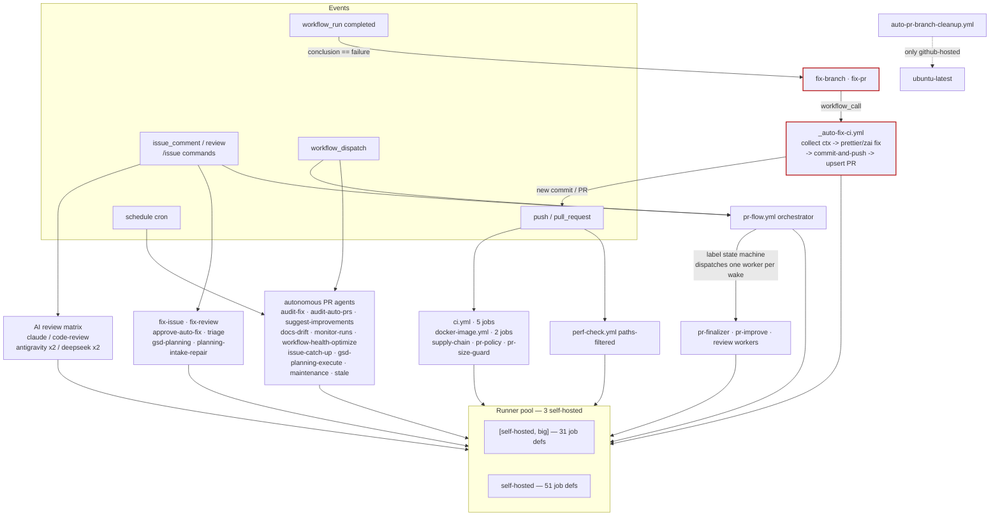

# GitHub Workflows — Architecture Review

**Scope:** 41 workflow YAMLs + 44 scripts (~13.4k LOC) + 20 composite actions in `.github/actions/`, plus co-located `documentation.md` and `policy.json`.
**Hard constraint:** a small pool of **self-hosted runners** (the design doc itself states "at least two … three or more currently" — `documentation.md:265`). Throughput, fast feedback, visibility, and correct flow ordering on that hardware are the primary lens.
**Lens:** architecture & redundancy · cost & reliability · maintainability.
**Method:** map-reduce audit — per-workflow fact extraction (triggers, runner tier, concurrency, permissions, secrets, external actions, scripts, load, overlap, red flags) across 6 functional clusters, then synthesis. Every claim cites the workflow file.

---

## 1. Global architecture

The 41 workflows fall into six functional clusters. They are **event-driven and heavily chained**: push/PR events run core CI; comment/label events drive a label-state PR orchestrator; `workflow_run` completions drive an auto-fix loop; and a large fleet of **scheduled autonomous agents** continuously analyze the repo and open "automation PRs."

### Cluster map

| Cluster | Workflows | Trigger flavor | Runner tier |
|---|---|---|---|
| **Core CI/CD** | `ci.yml`, `docker-image.yml`, `perf-check.yml`, `supply-chain.yml`, `dependency-review.yml`, `security-audit-weekly.yml` | push / PR / cron | big + self-hosted |
| **AI code review** | `claude.yml`, `code-review.yml`, `antigravity.yml`, `antigravity-code-review.yml`, `deepseek.yml`, `deepseek-code-review.yml` | comment / review / dispatch | big + self-hosted |
| **Autofix / audit** | `_auto-fix-ci.yml`, `approve-auto-fix.yml`, `audit-fix.yml`, `audit-auto-prs.yml`, `fix-branch.yml`, `fix-pr.yml`, `fix-issue.yml`, `fix-review.yml` | `workflow_run` / comment / cron | big + self-hosted |
| **PR lifecycle** | `pr-flow.yml`, `pr-flow-watchdog.yml`, `pr-finalizer.yml`, `pr-improve.yml`, `pr-policy.yml`, `pr-size-guard.yml`, `auto-pr-branch-cleanup.yml`, `release-notes.yml` | `pull_request_target` / comment / `workflow_run` / cron | self-hosted (+ 1 github-hosted) |
| **Planning / issues** | `gsd-planning.yml`, `gsd-planning-execute.yml`, `planning-intake-repair.yml`, `suggest-improvements.yml`, `issue-catch-up.yml`, `triage.yml` | comment / cron | big + self-hosted |
| **Housekeeping / monitor** | `stale.yml`, `cleanup-runner.yml`, `maintenance.yml`, `workflow-governance.yml`, `docs-drift.yml`, `monitor-amnezia-control-panel-github-runs.yml`, `workflow-health-optimize.yml` | cron / PR | self-hosted + big |

### Cross-cutting building blocks (good factoring)

- **`policy.json`** is the central trust/policy config: `trustedAutomationBranchPrefixes` (`claude-auto-fix-ci-`, `claude-fix-issue-`), `manualOnlyBranchPrefixes`, `cleanupBranchPrefixes`, `planningBranchPrefix`, `trustedPlanning` (with `requiredPassLabels`), `gsdExecution`. Consumed at runtime by `scripts/workflow-governance-check.cjs` and `scripts/evaluate-trigger-policy.cjs`.
- **`evaluate-trigger-policy.cjs`** is the **trigger gatekeeper** — referenced by **12 workflows**. It reads `policy.json` + `.github/pr-flow.json` and decides whether an event should actually proceed (command present? trusted branch? right labels? bot vs human?). This is the single most important anti-redundancy mechanism in the stack.
- **20 composite actions** in `.github/actions/` (`setup-environment`, `setup-bot-git`, `run-zai`, `run-deepseek`, `run-claude`, `prepare-automation-branch`, `commit-and-push`, `upsert-pull-request`, `build-automation-pr-body`, `ensure-workflow-labels`, `report-failure`, `run-npm-test-validation`, `run-gsd-validation-repair`, `prettier-auto-fix`, `collect-workflow-failure-context`, `ensure-docker-disk-space`, …). Step-level logic is well DRY'd here.
- **AI provider integrations:** ZAI (`run-zai`, `ZAI_API_KEY`) is the dominant provider — **19 workflows** call it — with Gemini (`antigravity*`, `GEMINI_API_KEY`/`AV_API_KEY`) and DeepSeek (`run-deepseek`, `DEEPSEEK_API_KEY`) as alternates.

### Trigger → workflow → runner flow

The red-highlighted loop is the critical chain: a failing CI run wakes `fix-branch.yml`/`fix-pr.yml` via `workflow_run`, they call the reusable `_auto-fix-ci.yml`, which commits and opens/updates a PR — re-triggering `push`/`pull_request` CI and (on failure) the loop again.

---

## 2. Redundancy map

| Redundancy set | Workflows | Recommendation |
|---|---|---|
| **AI code review — interactive** (`@mention` → provider agent) | `claude.yml`, `antigravity.yml`, `deepseek.yml` | **Consolidate.** Structurally identical: `authorize` (self-hosted) → run job on `[self-hosted, big]`, differing only in provider action (`run-zai` / `run-gemini-cli` / `run-deepseek`), trigger keyword, and secret. |
| **AI code review — `/review` command** | `code-review.yml`, `antigravity-code-review.yml`, `deepseek-code-review.yml` | **Consolidate.** Same `resolve-pr` + `authorize` + review-job shape, same "ignored" concurrency-group branch, differing only in provider + command. |
| **Autonomous "ZAI + commit-and-push + upsert-pull-request" PR pipeline** | `audit-fix.yml`, `audit-auto-prs.yml`, `_auto-fix-ci.yml`, `fix-issue.yml`, `fix-review.yml`, `gsd-planning.yml`, `suggest-improvements.yml`, `docs-drift.yml`, `monitor-amnezia-control-panel-github-runs.yml`, `workflow-health-optimize.yml` | **Consolidate (workflow level).** All compose the same composite actions in the same order with a provider prompt + branch-prefix + label set. The action-level code is already DRY; the *workflow-step* repetition remains. |
| **"Collect runs + ZAI analyze + report" monitors** | `monitor-amnezia-control-panel-github-runs.yml`, `workflow-health-optimize.yml` | **Consolidate.** Both poll workflow runs on a schedule, run ZAI, and open optimization PRs. Likely mergeable into one monitor with a mode flag. |
| **`report-failure` epilogue** | nearly every autonomous workflow ends with an identical `report-failure` job | **Keep** (already a composite action `report-failure`). No action needed beyond the workflow-level consolidation above. |

The 6 AI-review flows are the highest-value consolidation: collapsing the **{Claude/ZAI, Antigravity/Gemini, DeepSeek} × {interactive, code-review}** matrix into ≤2 reusable workflows removes ~600 lines of near-duplicate YAML and one whole class of "update one, forget the other five" drift.

---

## 3. Runner-contention analysis

This is the dominant risk surface. Quantitatively:

- **82 of 83 job-definitions run self-hosted** (`51` plain `self-hosted`, `31` `[self-hosted, big]`); only **1** is github-hosted (`auto-pr-branch-cleanup.yml` → `ubuntu-latest`).
- **31 jobs target the `big` label.** If "big" is a subset of the 3 runners, those 31 jobs contend for even fewer slots than the headline count implies.
- **19 workflows call ZAI** (network + latency + cost), many on the `big` tier.

### Peak-concurrency drivers

1. **Core CI fires unfiltered on every push/PR.** `ci.yml` runs **5** `[self-hosted, big]` jobs (lint, typecheck, test, build, security-audit) on every push to `main` and every PR `opened/synchronize/reopened`, with **no `paths`/`paths-ignore`** (`ci.yml:3-7`). A docs-only or workflow-only commit burns 5 big slots. `docker-image.yml` likewise has no path filter (`docker-image.yml:3-12`) and runs **two 30-minute** `[self-hosted, big]` build jobs per push/PR/tag. By contrast `perf-check.yml` *does* filter (`paths: ['src/**','package.json','next.config.*']`, `perf-check.yml:4-8`) — the pattern exists, the two heaviest jobs don't use it.
2. **A fleet of scheduled autonomous agents runs nearly continuously**, several **opening PRs** that re-trigger CI:
   - Hourly: `issue-catch-up.yml` (`:37`), `monitor-amnezia-control-panel-github-runs.yml` (`:56`, 25-min timeout), `workflow-health-optimize.yml` (`:07`).
   - Every 3 h: `audit-auto-prs.yml` (`:17`).
   - Every 6 h: `gsd-planning-execute.yml` (**60-minute timeout** — the single longest job in the repo).
   - Twice daily: `maintenance.yml`, `audit-fix.yml`.
   - Daily/weekly: `suggest-improvements.yml`, `docs-drift.yml`, `stale.yml`, `security-audit-weekly.yml`.
3. **Reactive amplification.** Every automation PR triggers `ci.yml` (5 jobs) plus the AI-review matrix on comment/label wakes via `pr-flow.yml`. One busy hour can stack: 3 hourly agents + their spawned CI runs + comment-driven AI reviews + a 60-min GSD execute — all queued behind 3 runners.

### Queue / starvation risks

- **`fix-review.yml` holds a `big` runner for 45 minutes** (`fix-review.yml:93`) per invocation — combined with a 60-min `gsd-planning-execute` and 25-min `monitor-runs`, two long jobs can pin the entire `big` pool and stall everything else.
- **Scheduled jobs correctly queue, not cancel.** The autonomous-PR workflows set `cancel-in-progress: false` (`issue-catch-up.yml:15`, `workflow-health-optimize.yml:10`), so overlapping ticks of the *same* workflow queue rather than abort mid-flight ZAI work — good. The real gap is **cross-workflow**: different scheduled agents share no concurrency group, so they run concurrently and each spawns its own CI.
- **No global concurrency cap** across the autonomous-PR fleet — nothing prevents 5 agents from opening PRs in the same window and each spawning a 6-job CI run.

### What should move to github-hosted

Light, read-only, API-only jobs free self-hosted capacity for the 31 `big` jobs. Strong candidates (currently self-hosted, no build/test dependency): `pr-size-guard.yml`, `pr-policy.yml`, `pr-flow-watchdog.yml`, `stale.yml`, `cleanup-runner.yml`, `workflow-governance.yml`, and the `collect-*` first jobs of the monitors. `auto-pr-branch-cleanup.yml` already proves the pattern (`ubuntu-latest`, 5-min, same-repo guard).

---

## 4. Maintainability

**Strengths**

- **Composite-action layering is healthy.** Step logic lives in 20 reusable actions under `.github/actions/`; `evaluate-trigger-policy.cjs` + `policy.json` centralize trigger/branch-trust decisions consumed by 12 workflows.
- **All external actions are pinned to commit SHAs** — `actions/checkout@df4cb1c…`, `actions/github-script@3a2844b…`, `docker/build-push-action@f9f3042…`, `google-github-actions/run-gemini-cli@f77273f…`, `actions/stale@eb5cf3a…`. No floating tags. ✓
- **No dead scripts.** All 44 files under `scripts/` are reachable (directly from a workflow or transitively via a composite action). `scripts/__tests__/` and `scripts/lib/sticky-comment.cjs` are shared infra.
- **`_auto-fix-ci.yml` is correctly a reusable `workflow_call` workflow**, called by both `fix-branch.yml` and `fix-pr.yml` — good factoring of the fix engine.

**Gaps**

- **`documentation.md` (475 lines) is misplaced.** It is a genuine architecture/setup reference (secrets table, PR-flow state machine, runner-count assumption, job/duration/runner-label table), but it lives in `.github/workflows/` alongside runnable YAML. `policy.json` is correctly co-located (runtime config consumed by scripts); `documentation.md` belongs in `docs/`.
- **Workflow-level duplication** remains despite action-level DRYness (see §2). The autonomous-PR pipeline is re-stitched ~10 times.
- **Secret surface is broad.** **17 workflows** use `secrets.GH_PAT` (a broad personal-access token) for cross-resource ops (`upsert-pull-request`, `commit-and-push`). A single compromised workflow job leaks a wide-scoped PAT. Prefer `GITHUB_TOKEN` where the operation is in-repo; scope `GH_PAT` to the minimum and document why each usage needs it.

---

## 5. Risks

| # | Risk | Where | Real? |
|---|---|---|---|
| R1 | **Auto-fix runaway loop / runaway cost.** `workflow_run(failure)` → `fix-branch`/`fix-pr` → `_auto-fix-ci` → commit/push → CI → failure → loop. | `fix-branch.yml:22-44`, `fix-pr.yml:25-44`, `_auto-fix-ci.yml` | **Real.** Guarded only by branch-prefix checks (`policy.json trustedAutomationBranchPrefixes`; `fix-branch.yml:43` `!startsWith(...,'claude-auto-fix-ci-')`). A fix-PR whose *own* CI fails re-enters `fix-pr` → repeated ZAI spend + runner hog. No per-PR attempt cap or cooldown seen. |
| R2 | **Runner starvation / slow feedback.** 31 `big` jobs + continuous scheduled agents on 3 runners. | §3 | **Real and ongoing** — the design doc acknowledges the tight runner assumption. |
| R3 | **`pull_request_target` with checkout.** `pr-flow.yml` checks out PR code in a `pull_request_target` context (`pr-flow.yml:81-82`) with a token-bearing job; `pr-policy.yml` also uses `pull_request_target`. | `pr-flow.yml:8-17,81`, `pr-policy.yml:6-9` | **Borderline.** Both appear to run only repo-trusted scripts (`orchestrate-pr-flow.cjs`, `evaluate-pr-policy.cjs`) and the `pr-policy.yml` comment states "read PR metadata and apply labels/status." Classic `pull_request_target` vuln is executing/checkout of attacker-controlled code with secrets — the checkout-of-PR-ref in a token context is the surface to audit. |
| R4 | **Broad permissions on AI workflows.** `dependency-review.yml` requests `contents: read`, `pull-requests: write`, `issues: write`, **`actions: write`** (`dependency-review.yml:26-30`) for a ZAI dependency review. | `dependency-review.yml:26-30` | **Real (low).** `actions: write` is broad for a review; scope down unless it must cancel/dispatch runs. |
| R5 | **Broad `GH_PAT` exposure across 17 workflows.** | §4 | **Real.** Defense-in-depth concern, not an active vuln. |
| R6 | **Missing `paths` filters cause unnecessary runs** (cost + contention). | `ci.yml`, `docker-image.yml` | **Real.** Drives R2. |

---

## 6. Prioritized backlog

### P0 — correctness / cost / runner-starvation

| ID | Problem | Fix | Effort | Files |
|---|---|---|---|---|
| **P0-1** | `ci.yml` (5 `big` jobs) and `docker-image.yml` (two 30-min `big` jobs) fire on **every** push/PR with no path filter — including docs/workflow-only changes — wasting runner slots and ZAI-adjacent cost. | Add `paths-ignore` (e.g. `**/*.md`, `docs/**`, `.github/workflows/**`, `LICENSE`) or a positive `paths:` include, mirroring `perf-check.yml:4-8`. | **S** | `ci.yml`, `docker-image.yml` |
| **P0-2** | Auto-fix loop (R1) has no per-PR attempt cap or cooldown — a fix-PR that keeps failing re-enters `fix-pr` indefinitely. | Add a per-PR attempt counter / cooldown: e.g. a label `auto-fix-attempted-N` gated by `policy.json`, or a `fix-pr` step that bails if the PR already has a recent fix commit / max attempts reached. | **M** | `fix-pr.yml`, `fix-branch.yml`, `_auto-fix-ci.yml`, `policy.json` |
| **P0-3** | Scheduled autonomous-PR fleet (3 hourly + every-3h + every-6h 60-min) creates PRs that each spawn 6-job CI runs, stacking on 3 runners. | (a) Consolidate the monitor/optimizer agents into fewer windows; (b) add a global "automation budget"/concurrency gate so N agents can't open PRs simultaneously; (c) move read-only `collect-*` first jobs to `ubuntu-latest`. | **M–L** | `issue-catch-up.yml`, `monitor-amnezia-control-panel-github-runs.yml`, `workflow-health-optimize.yml`, `gsd-planning-execute.yml`, `audit-auto-prs.yml` |
| **P0-4** | `fix-review.yml` pins a `big` runner for **45 min** per run; combined with 60-min GSD execute + 25-min monitor, two long jobs can stall the `big` pool. | Split the 45-min job into reviewable chunks, or add a concurrency cap / lower `timeout-minutes` with resumable state. | **S–M** | `fix-review.yml` |

### P1 — consolidation & feedback speed

| ID | Problem | Fix | Effort | Files |
|---|---|---|---|---|
| **P1-1** | 6 near-identical AI-review workflows ({claude/zai, antigravity/gemini, deepseek} × {interactive, code-review}); update-one-forget-five drift. | Collapse into ≤2 reusable workflows parameterized by `provider` + `mode`; drive provider set via a matrix or input. | **L** | `claude.yml`, `code-review.yml`, `antigravity.yml`, `antigravity-code-review.yml`, `deepseek.yml`, `deepseek-code-review.yml` |
| **P1-2** | ~10 workflows re-stitch the same "ZAI → commit-and-push → upsert-pull-request → report" autonomous-PR pipeline at the step level. | Extract one reusable "automation-PR" workflow (inputs: prompt/task type, branch prefix, labels, report mode). | **L** | see §2 redundancy set |
| **P1-3** | 82/83 jobs are self-hosted; light read-only jobs occupy runner capacity the 31 `big` jobs need. | Move API-only/light jobs to `ubuntu-latest`: `pr-size-guard`, `pr-policy`, `pr-flow-watchdog`, `stale`, `cleanup-runner`, `workflow-governance`, and monitor `collect-*` first jobs. | **M** | (those workflows) |
| **P1-4** | `pull_request_target` + checkout-of-PR-ref in `pr-flow.yml` (R3) — verify invariant that no untrusted PR code executes in the token-bearing context. | Audit `pr-flow.yml`/`pr-policy.yml`: confirm checkout is metadata-only or pinned to a safe ref; scope `GITHUB_TOKEN` to read-only for the `pull_request_target` jobs; document the invariant in a comment. | **S** (audit) / **M** (harden) | `pr-flow.yml`, `pr-policy.yml` |

### P2 — polish

| ID | Problem | Fix | Effort | Files |
|---|---|---|---|---|
| **P2-1** | `documentation.md` (475-line architecture/setup guide) is misplaced in `.github/workflows/`. | Move to `docs/` (e.g. `docs/workflows-architecture.md`); keep a one-line pointer if scripts expect a path. | **S** | `documentation.md` → `docs/` |
| **P2-2** | `dependency-review.yml` requests `actions: write` for an AI review (R4). | Drop to the minimum scopes needed (likely `contents: read` + `pull-requests: write`); remove `actions: write` unless it must dispatch/cancel. | **S** | `dependency-review.yml` |
| **P2-3** | Cron offsets are partially staggered (`issue-catch-up.yml:5` notes the offset from `workflow-health-optimize`); not all scheduled jobs follow the discipline, and different agents share no concurrency group. | Add a "cron calendar" table to the architecture doc and offset every scheduled job to avoid collisions (cross-workflow gating tracked under P0-3). | **S** | scheduled workflows + doc |
| **P2-4** | 17 workflows use a broad `GH_PAT`; rationale is undocumented per usage. | Audit each `GH_PAT` usage; replace with `GITHUB_TOKEN` where in-repo ops suffice; document remaining PAT needs. | **M** | the 17 workflows |
| **P2-5** | Pinning convention is good but implicit. | Record the "pin all external actions to SHAs" rule in `docs/code-standards.md` for future maintainers. | **S** | `docs/code-standards.md` |

---

## Appendix — fact-sheet index (per file)

Compact one-liners; see clusters above for grouping.

**Core CI/CD**
- `ci.yml` — lint/typecheck/test/build/security-audit; `push`(main)+`pull_request`; no path filter; `contents:read,actions:read`; `ci-{ref}` cancel; 5× `[self-hosted,big]` 10m; `build-metrics.cjs`,`check-prisma-safe-sql.cjs`,`__tests__/`. **Biggest runner hog.**
- `docker-image.yml` — build/publish image; `push`(main)+tags+`pull_request`+`workflow_dispatch`; no path filter; `docker-image-{ref}` cancel; classify(self-hosted 5m)→docker-build(30m `big`)+publish(30m `big`); all docker actions SHA-pinned; attestation. **Very heavy.**
- `perf-check.yml` — PR perf build/metrics; `pull_request` **paths-filtered**; `perf-{pr}` cancel; `[self-hosted,big]` 10m; `build-metrics.cjs`. ✓ path-filter template.
- `supply-chain.yml` — policy check; `push`+`pull_request`+`workflow_dispatch`; `supply-chain-{ref}` cancel; `self-hosted` 10m; `workflow-governance-check.cjs`; `continue-on-error`.
- `dependency-review.yml` — ZAI dep review; `workflow_dispatch` only (orchestrated); **broad perms incl `actions:write`**; `dep-review-{…}` cancel; resolve-pr→ai-dependency-review(`big`,`ZAI`)→finalize. Overlaps AI-review concept.
- `security-audit-weekly.yml` — npm/audit; weekly cron Mon 06:17+`workflow_dispatch`; `issues:write`; `security-audit-weekly` no-cancel; `[self-hosted,big]` 10m; `continue-on-error`; posts issue on fail.

**AI code review** — `claude.yml`/`code-review.yml` (ZAI, `@claude`/`/review`), `antigravity.yml`/`antigravity-code-review.yml` (Gemini), `deepseek.yml`/`deepseek-code-review.yml` (DeepSeek). Interactive trio: comment/review triggers, `authorize`→run on `[self-hosted,big]` 10m, `provider-{pr\|issue\|sha}` cancel. Review trio: comment+`workflow_dispatch`, `resolve-pr`→`authorize`→review, "ignored"-branch concurrency. All external actions SHA-pinned.

**Autofix/audit**
- `_auto-fix-ci.yml` — **reusable `workflow_call`** fix engine; `contents:read,actions:read`; `[self-hosted,big]` 10m; collect-failure-context→prettier/zai fix→commit-and-push→upsert-PR; `GH_PAT`+`ZAI_API_KEY`. Called by fix-branch/fix-pr.
- `approve-auto-fix.yml` — `issue_comment` approve automation PRs; `issues:write`; `self-hosted`; `GH_PAT`.
- `audit-fix.yml` — scheduled autonomous fixer (2×/day 09:53,21:53)+dispatch; `[self-hosted,big]` **30m**; zai→commit→upsert-PR; report jobs; `GH_PAT`.
- `audit-auto-prs.yml` — scheduled read-only audit of auto-PRs (every 3h `:17`)+dispatch; `[self-hosted,big]` 15m; explicitly read-only ("do NOT mutate existing PRs"); `GH_PAT`.
- `fix-branch.yml` — **`workflow_run(failure)`** on main/develop w/o PR→calls `_auto-fix-ci`; guard `!startsWith 'claude-auto-fix-ci-'`; `issues:write`. **Loop entry.**
- `fix-pr.yml` — **`workflow_run(failure)`** with PR→calls `_auto-fix-ci`; `fix-pr-{pr\|sha}` cancel; `issues:write`. **Loop entry.**
- `fix-issue.yml` — `issue_comment`/`issues` `/fix`→zai fix→upsert-PR; `[self-hosted,big]`; `GH_PAT`.
- `fix-review.yml` — `issue_comment`(`/fix-review`,`/address-review`)+dispatch→zai address review→commit; `[self-hosted,big]` **45m** (longest single job); "ignored"-branch concurrency (PR #434). `check-prisma-safe-sql.cjs`,`collect-review-feedback.cjs`,`evaluate-pr-policy.cjs`,`upsert-fix-review-comment.cjs`.

**PR lifecycle**
- `pr-flow.yml` — **PR Orchestrator hub**; `issue_comment`+**`pull_request_target`**+`workflow_run`+`workflow_dispatch`; `statuses:write,issues:write`; complex `prt`-vs-`wake` concurrency isolation (PR #434); self-hosted 5–10m; `orchestrate-pr-flow.cjs`,`evaluate-trigger-policy.cjs`. **pull_request_target checkout surface (R3).**
- `pr-flow-watchdog.yml` — schedule+dispatch; `statuses:read,issues:read`; self-hosted; `watch-pr-flow.cjs`. Wakes stuck flows.
- `pr-finalizer.yml` — `workflow_dispatch`(reacts to `workflow_run`); `issues:write`; `pr-finalizer-{…}`; self-hosted 15m; `evaluate-pr-finalizer-decision.cjs`,`resolve-pr-context.cjs`.
- `pr-improve.yml` — `workflow_dispatch` ZAI PR improvement→commit; `[self-hosted,big]` 15m; `evaluate-pr-policy.cjs`,`upsert-planning-pr.cjs`; `GH_PAT`.
- `pr-policy.yml` — **`pull_request_target`** label/status policy; `issues:write,statuses:write`; `pr-policy-{pr}`; self-hosted 10m; metadata-only by design (R3).
- `pr-size-guard.yml` — `pull_request` size comment; self-hosted 10m; `upsert-pr-size-comment.cjs`. **Move to github-hosted candidate.**
- `auto-pr-branch-cleanup.yml` — `pull_request` delete merged branches; **`ubuntu-latest`** 5m; same-repo guard. ✓ Right-sized.
- `release-notes.yml` — release-triggered ZAI release notes; self-hosted 10m; `run-zai`; `acp-agent.sh`,`deploy-server.sh` referenced.

**Planning/issues**
- `gsd-planning.yml` — `issue_comment`/dispatch GSD plan→zai→upsert-PR; `[self-hosted,big]`; `GH_PAT`.
- `gsd-planning-execute.yml` — **every-6h cron**+dispatch; `[self-hosted,big]` **60m** (longest job); zai execute→npm-test-validation+gsd-validation-repair (looped, `continue-on-error`)→commit→upsert-PR; report. **Major runner hog.**
- `planning-intake-repair.yml` — `issue_comment`(`/planning-rename-milestones`)/dispatch; self-hosted 15m; `repair-planning-intake.cjs`; `GH_PAT`.
- `suggest-improvements.yml` — daily 00:11+dispatch zai suggestions→upsert-PR; `[self-hosted,big]` 10m; `GH_PAT`.
- `issue-catch-up.yml` — **hourly `:37`**+dispatch; collect-issues(self-hosted)→analyze-and-act(`[self-hosted,big]`,zai)→report; `GH_PAT`. Offset noted from `:07`.
- `triage.yml` — `issues`/`issue_comment`(`/triage`)/dispatch; `[self-hosted,big]` 10m; `edit-issue-labels.sh`,`gh.sh`; zai triage.

**Housekeeping/monitor**
- `stale.yml` — weekly Sun 01:23+dispatch; `issues:write`; self-hosted 10m; `actions/stale@eb5cf3a…`.
- `cleanup-runner.yml` — `workflow_dispatch` only; self-hosted 10m; runner disk cleanup; `continue-on-error`.
- `maintenance.yml` — 2×/day 06:41,18:41+dispatch; `[self-hosted,big]` 10m; zai maintenance→report; `GH_PAT`.
- `workflow-governance.yml` — `pull_request`+dispatch; self-hosted 10m; `workflow-governance-check.cjs`; upload-artifact. Enforces `policy.json`.
- `docs-drift.yml` — weekly Sun 03:29+dispatch zai docs check→upsert-PR; `[self-hosted,big]`; `GH_PAT`.
- `monitor-amnezia-control-panel-github-runs.yml` — **hourly `:56`**+dispatch; `[self-hosted,big]` **25m**; zai monitor→commit→upsert-PR; `find-duplicate-automation-pr.cjs`,`parse-claude-execution.cjs`,`workflow-run-timings.cjs`; `GH_PAT`. **Runner hog.**
- `workflow-health-optimize.yml` — **hourly `:07`**+dispatch; collect-runs(self-hosted)→optimize(`[self-hosted,big]`,15m,zai→upsert-PR)→report; `GH_PAT`. Overlaps monitor-runs.

**Co-located non-workflow files**
- `policy.json` — central trust/policy config (branch prefixes, label gates, `gsdExecution`); consumed by `workflow-governance-check.cjs` + `evaluate-trigger-policy.cjs`. Correctly co-located.
- `documentation.md` — 475-line architecture/setup reference; misplaced (→ `docs/`, P2-1).

---

*Audit method: per-file fact extraction via targeted grep across all 41 YAMLs + referenced scripts + 20 composite actions; runner-load, secret, and trigger-type counts verified by repo-wide grep. Open questions for the operator: (1) how many of the 3 runners carry the `big` label? (2) Is there any global/cross-workflow concurrency gate today, or do all scheduled agents run uncoordinated (each free to open PRs in the same window)? (3) Is there an existing per-PR auto-fix attempt cap elsewhere (e.g. in `policy.json` `gsdExecution`) that this audit should reference?*
