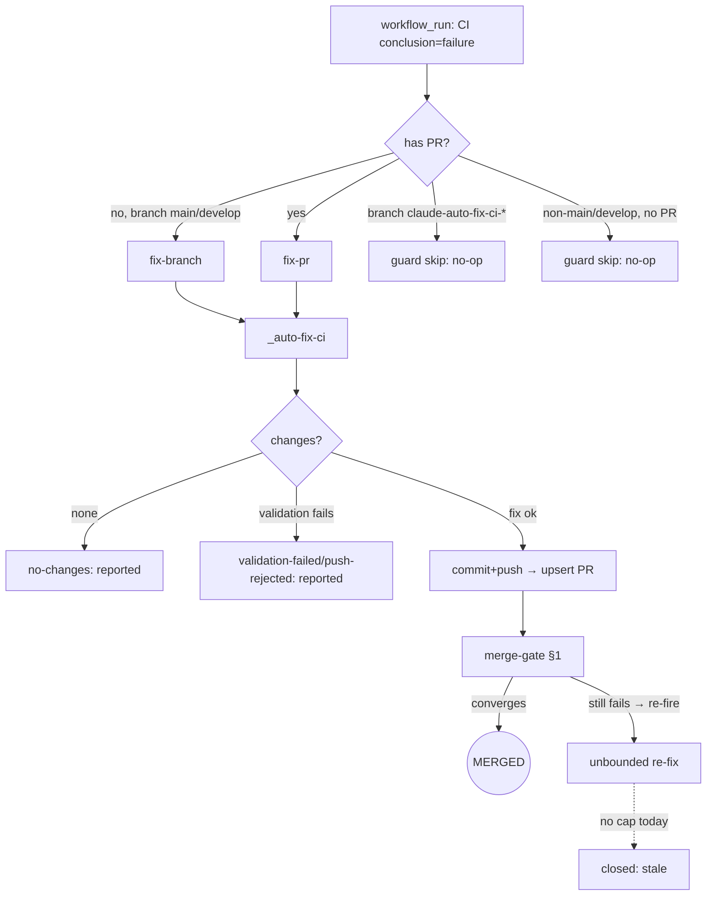
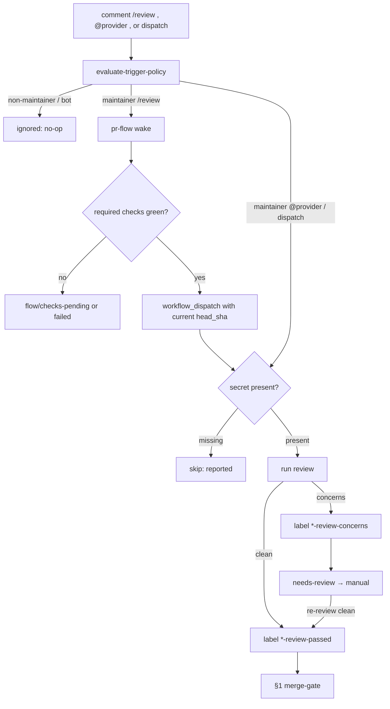
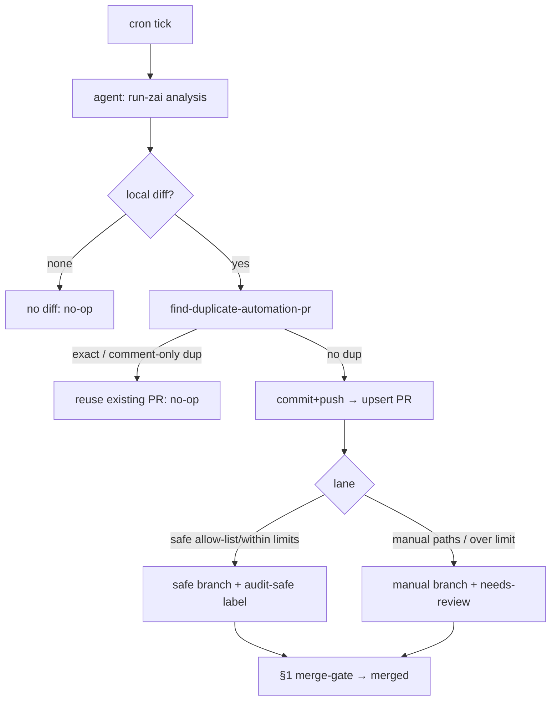
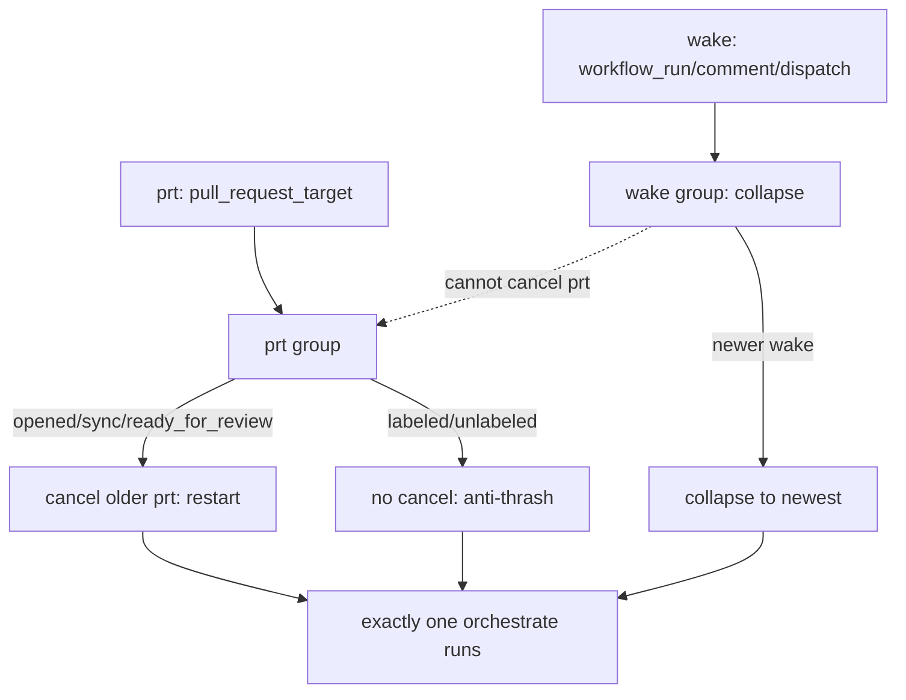
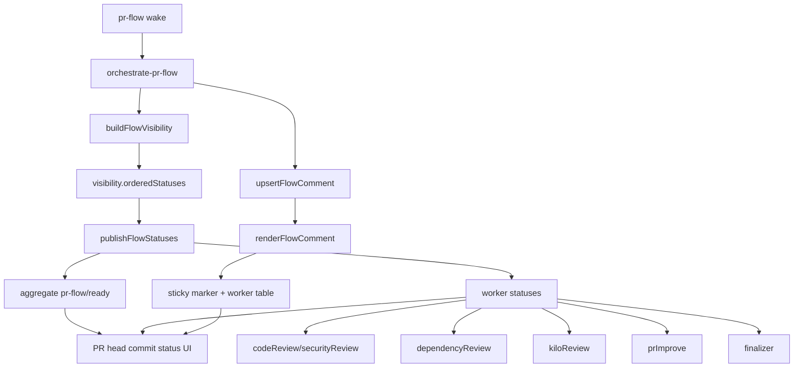
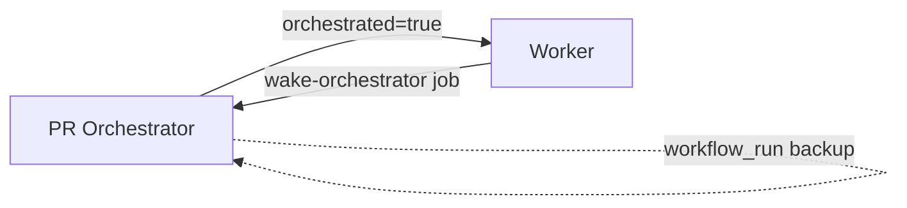
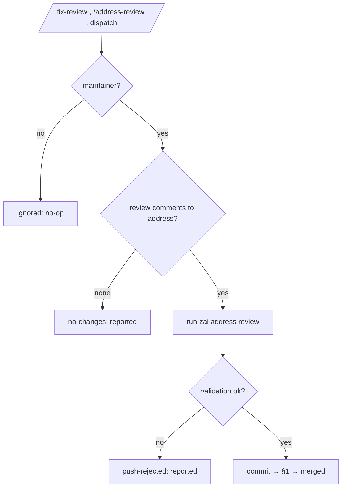
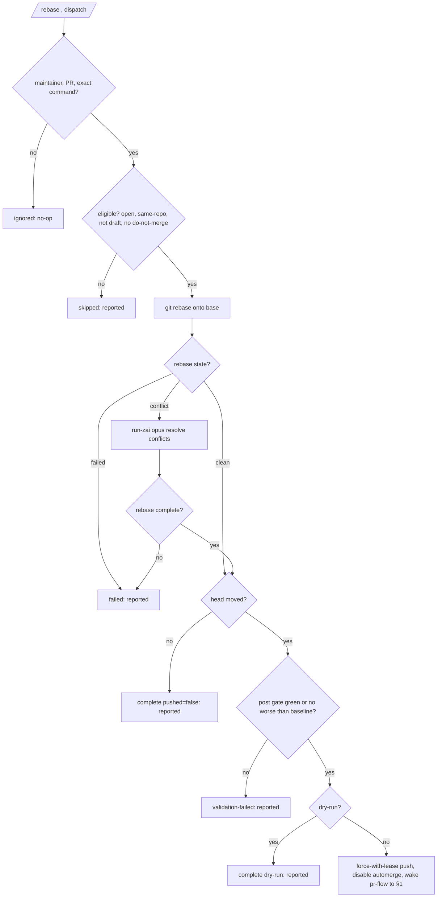

# Workflow E2E Scenario Catalog

Exhaustive end-to-end scenarios for the GitHub-workflow automation stack. **Every case is a full path: trigger → terminal.** Intermediate statuses (`awaiting_checks`, `blocked`, `manual_only`, `needs-review`) are waypoints, not endpoints — each carries a resolution arm to a terminal.

This catalog is the **spec for the characterization + spec test suite** (`scripts/__tests__/e2e-*.test.cjs`, run in CI via `ci.yml:61`) and the **validation surface for every future workflow change** (see `docs/code-standards.md` → "Workflow change protocol"). Glossary: `.github/workflows/CONTEXT.md`.

## How to read

- **char** — characterization test. Locks CURRENT behavior as a green regression baseline.
- **spec** — spec test. Asserts an INTENDED invariant; may be **red today**, drives a Phase-2 fix (TDD red→green). The `P0-x` tag names the fix.
- **TR** — tracked-red. Known gap, deferred, but recorded so it is _checked_ (visible / fail-loud).
- **char [verify]** — characterization whose exact outcome must be locked during the run (a code detail not yet fully traced).
- **Valid terminals:** `merged` · `closed` · `no-op`/`reported`.
- **Human-merge rule:** `manual_only` cases terminate at **`merged (human)`** — an _external_ terminal we trust (not asserted by the scripts). The 90-day `stale→close` fallback is documented but not modeled per-case. **Issue auto-closure** (`closes #N`) is a _post-merge side-effect_ noted only on automation-merge cases, never on human-merge cases.
- **Terminal model (hybrid):** the flow-simulator asserts the **terminal decision** the scripts emit (`approve_and_enable_automerge` ⇒ merged; a stale/close condition ⇒ closed). GitHub-side completion (auto-merge, human merge, stale close) is covered by separate narrow tests (`pr-finalizer.yml:128-153` merge step; `stale.yml` 60+30-day config), not mocked.

> Case outcomes are enumerated from each flow's decision-script branches; exact outputs are **locked by the characterization run** — if a row is subtly off, the test captures the real behavior and the row is corrected then.

---

## §1 Merge gate — `pr-finalizer.yml` (+ `pr-flow.yml`)

Decision basis: `evaluate-pr-finalizer-decision.cjs` (draft / hard-block / manual-review / manual-only / metadata / check-fail / pending / ready), `required-check-evidence.cjs` (success→pass / **skipped→skip (non-blocking)** / **cancelled→cancel (blocking)** / failure→fail / missing→pending), `policy.json` (`blockingLabels`, `manualOnlyBranchPrefixes`, `manualOnlyPathGlobs`, `generatedStatePathGlobs`, `trustedPlanning.requiredPassLabels`).

```mermaid
flowchart TD
  T[trigger: pr-flow wake<br/>label/comment/check/run] --> CL[pr-flow classify]
  CL -->|draft| D[awaiting_checks]
  CL -->|hard block label| BL[blocked]
  CL -->|needs-review / manualOnly| MO[manual_only]
  CL -->|checks pending/missing| AC[awaiting_checks]
  CL -->|checks pass + trusted| RD[approve_and_enable_automerge]
  D -->|ready_for_review| CL
  BL -->|unlabeled| CL
  BL -.->|stale 90d| X1[closed]
  MO -->|maintainer unlabeled / human merge| RD
  MO -.->|stale 90d| X1
  AC -->|check completes| CL
  RD --> M((MERGED))
  X1 -->((CLOSED))
```

| ID  | Trigger / precondition                                                 | Resolution → terminal                                        | Type                                            |
| --- | ---------------------------------------------------------------------- | ------------------------------------------------------------ | ----------------------------------------------- |
| M1  | PR is draft                                                            | `ready_for_review` → orchestrate → M13                       | char                                            |
| M2  | hard block label (`do-not-merge`…)                                     | `unlabeled` → re-gate; else stale→close                      | char                                            |
| M3  | `needs-review`, non-maintainer                                         | maintainer `unlabeled` → M13; else stale→close               | char                                            |
| M4  | `needs-review`, maintainer-approved                                    | proceeds → M13                                               | char                                            |
| M5  | `manualOnlyBranchPrefixes` (`claude-audit-fix-`)                       | human merge                                                  | char                                            |
| M6  | `manualOnlyPathGlobs` (`.github/**`,`/.planning/**`)                   | human merge                                                  | char                                            |
| M7  | fork / cross-repo (untrusted scope)                                    | human merge                                                  | char                                            |
| M8  | `generatedStatePathGlobs` (`graphify-out/**`)                          | push removes files (`synchronize`)→re-gate; else close       | char                                            |
| M9  | required check **FAILED**                                              | blocked (no auto-merge)                                      | char                                            |
| M10 | required check **PENDING**                                             | check completes → M13 / M9                                   | char                                            |
| M11 | required check **SKIPPED** (job-level)                                 | `skip` bucket (non-blocking) → M13; `cancelled` still blocks | char (`required-check-evidence.cjs:86,185-191`) |
| M12 | required check **MISSING** (whole wf path-filtered out)                | today: stale→close; **after fix: → M13**                     | **spec P0-1**                                   |
| M13 | all review labels + checks pass + trusted                              | `approve_and_enable_automerge` → **merged**                  | char                                            |
| M14 | all pass + untrusted branch                                            | manual_only → human **merged**                               | char                                            |
| M15 | missing `required_pass_label`                                          | AI review runs → `labeled *-passed` → M13                    | char                                            |
| M16 | auto-merge _enablement_ fails (`gh pr merge --auto`/`--approve` error) | status=failed, reported, PR open for human                   | char                                            |
| M17 | mixed required-check states (pass + skipped + pending)                 | pending dominates → awaiting → resolves on completion        | char                                            |
| M18 | auto-merge armed, later required check goes red                        | GitHub won't merge → re-enters blocked                       | char                                            |
| M19 | `dry_run` mode                                                         | decision-only, no approve/merge/comment                      | char                                            |

---

## §2 Auto-fix loop — `fix-branch.yml` / `fix-pr.yml` / `_auto-fix-ci.yml` (+ `approve-auto-fix.yml`)

Decision basis: `workflow_run` scoped to **`workflows: ['CI']`** (`fix-branch.yml:22`, `fix-pr.yml:25`) + failure/branch/PR guards (`fix-branch.yml:40-44`, `fix-pr.yml:43-44`), `_auto-fix-ci.yml` CI-matching gate + sticky statuses (`documentation.md:91-93`), `policy.json trustedAutomationBranchPrefixes`. The fix commit is gated by `validate-pr-gate` before push; a gate failure means no push (no fix PR).



| ID  | Trigger / precondition                    | Resolution → terminal                                                                                         | Type        |
| --- | ----------------------------------------- | ------------------------------------------------------------------------------------------------------------- | ----------- |
| A1  | CI fails on `main`/`develop`, no PR       | fix-branch → `_auto-fix-ci` → fix PR → §1 → **merged**                                                        | char        |
| A2  | CI fails on a PR                          | fix-pr → `_auto-fix-ci` → push → CI re-run → §1 (**converges→merged** or **loops→A8**)                        | char        |
| A3  | CI fails on `claude-auto-fix-ci-*` branch | guard `!startsWith` → **no-op** (loop guard)                                                                  | char        |
| A4  | CI fails on non-main/develop, no PR       | branch allow-list guard → **no-op**                                                                           | char        |
| A5  | CI **passes**                             | conclusion≠failure → not triggered → n/a                                                                      | char        |
| A6  | fix produces no changes                   | sticky `no-changes` → no commit → **reported**                                                                | char        |
| A7  | fix fails CI-matching gate before push    | `validation-failed`/`push-rejected` → no push → **reported**                                                  | char        |
| A8  | fix-PR's own CI keeps failing             | capped after `maxAutoFixAttempts` (3): evaluate-trigger-policy declines further runs → **reported** (no loop) | char (P0-2) |
| A9  | maintainer `/approve` on automation PR    | approve-auto-fix → approve + auto-merge → **merged**                                                          | char        |
| A10 | non-CI workflow failure (review/dep/etc.) | fix-\* CI-scoped → **no-op** (no auto-fix)                                                                    | char        |
| A11 | fix push disables auto-merge              | bot commit needs re-review → manual → **merged**                                                              | char        |

---

## §3 AI-review label contract — `code-review`/`claude`/`antigravity(-code-review)`/`deepseek(-code-review)` (+ `dependency-review`)

Decision basis: `evaluate-trigger-policy.cjs` modes (`claude`/`antigravity`/`deepseek`/`*-review`) → `should_run`/`trusted`; secret checks (`DEEPSEEK_API_KEY`, `GEMINI_API_KEY`/`AV_API_KEY`, `ZAI_API_KEY`); label outputs (`*-review-passed`/`*-review-concerns`, `deps-review-{passed,manual,blocked}`). Provider is a **parameter** — providers sharing one label contract are one parametrized case, not duplicated.



| ID   | Trigger / precondition                                                               | Resolution → terminal                                                                                         | Type          |
| ---- | ------------------------------------------------------------------------------------ | ------------------------------------------------------------------------------------------------------------- | ------------- |
| R1   | maintainer `/review` on PR after required checks are green                           | pr-flow wake → `workflow_dispatch` with current `head_sha` → review → `*-review-passed` → §1 → **merged**     | char          |
| R1b  | maintainer `@provider` on PR (parametrized over provider)                            | provider review → `*-review-passed` → §1 → **merged**                                                         | char          |
| R2   | review finds concerns                                                                | `*-review-concerns` → needs-review → manual                                                                   | char          |
| R3   | non-maintainer command                                                               | `should_run=false` (concurrency "ignored" branch) → **no-op**                                                 | char          |
| R4   | bot comment                                                                          | ignored branch → **no-op** (anti-loop)                                                                        | char          |
| R5   | provider secret missing                                                              | check-secrets → skip → **reported**                                                                           | char          |
| R6   | `@provider` on an **issue** (non-PR)                                                 | interactive agent responds (issue flow, not a gate)                                                           | char          |
| R7   | `workflow_dispatch` orchestrated by pr-flow                                          | trusted → review runs → label → §1                                                                            | char          |
| R7b  | manual `/review` after stale/cancelled current-head review and green required checks | stale review labels removed → Code Review redispatched by pr-flow → `flow/review-pending` until labels return | spec          |
| R8a  | dependency-review: clean                                                             | `deps-review-passed` → §1 → **merged**                                                                        | char          |
| R8b  | dependency-review: manual finding                                                    | `deps-review-manual` → manual (human decides)                                                                 | char          |
| R8c  | dependency-review: blocked                                                           | `deps-review-blocked` → manual (human decides; **not** auto-close)                                            | char          |
| R9   | review on a **draft** PR                                                             | not orchestrated → **no-op**                                                                                  | char          |
| R11  | antigravity secret fallback (`GEMINI_API_KEY` ∥ `AV_API_KEY`)                        | runs with whichever present → label                                                                           | char          |
| R12  | review exceeds `MAX_TURNS`                                                           | truncated → label locked during run                                                                           | char [verify] |
| R13  | Kilo current-head summary says `No Issues Found`                                     | `pr-flow/kilo-review=success` → PR Flow continues                                                             | char          |
| R13b | Kilo sticky summary is edited after current head with `No Issues Found`              | edited sticky `<!-- kilo-review -->` wakes PR Flow → `pr-flow/kilo-review=success` → PR Flow continues        | spec          |
| R14  | Kilo current-head summary or inline comments contain issues                          | `pr-flow/kilo-review=failure` → `flow/review-blocked`                                                         | char          |
| R15  | Kilo issues are only on older head commits                                           | stale Kilo findings ignored → waits/passes based on current-head signal                                       | char          |
| R16  | Kilo check is cancelled/skipped                                                      | `pr-flow/kilo-review=N/A` → PR Flow continues                                                                 | char          |
| R17  | no current-head Kilo reply under 30 minutes                                          | `pr-flow/kilo-review=pending` → `flow/review-pending`                                                         | char          |
| R18  | no current-head Kilo reply after 30 minutes                                          | watchdog wakes PR Flow → `pr-flow/kilo-review=N/A` → PR Flow continues                                        | char          |

---

## §4 Autonomous-PR fleet — scheduled agents (`audit-fix`, `audit-auto-prs`, `suggest-improvements`, `docs-drift`, `monitor-…runs`, `workflow-health-optimize`, `issue-catch-up`, `gsd-planning-execute`, `maintenance`)

Decision basis: common pipeline `run-zai → prepare-automation-branch → find-duplicate-automation-pr → validate-pr-gate → commit-and-push → upsert-pull-request`; lane classification `classify-audit-fix.cjs` + `evaluate-pr-policy.cjs` (safe vs manual by path/count); `find-duplicate-automation-pr.cjs` (exact / comment-only dedup). `audit-fix` / `monitor-amnezia-control-panel-github-runs` / `workflow-health-optimize` gate their push on `validate-pr-gate` (`.github/actions/validate-pr-gate`); a gate failure posts a not-pushed summary instead of creating a PR.



| ID  | Trigger / precondition                                                      | Resolution → terminal                                                                                     | Type          |
| --- | --------------------------------------------------------------------------- | --------------------------------------------------------------------------------------------------------- | ------------- |
| P1  | agent diff, no duplicate (generic baseline)                                 | create PR → classify lane → §1 → **merged** / manual                                                      | char          |
| P2  | diff exactly matches open PR                                                | `duplicate_found=exact` → **no-op** (dedup)                                                               | char          |
| P3  | diff comment-only-equivalent                                                | `duplicate_found` (comment-only) → **no-op**                                                              | char          |
| P4  | no local diff                                                               | "No local diff detected" → **no-op**                                                                      | char          |
| P5  | audit-fix within safe allow-list/limits                                     | `claude-audit-safe-fix-` + `audit-safe` → auto-merge → **merged**                                         | char          |
| P6  | audit-fix over limit / manual-only paths                                    | `claude-audit-fix-` + `needs-review` → manual                                                             | char          |
| P7  | gsd-execute diff within `.planning/**` safe globs                           | trusted → §1 → **merged**                                                                                 | char          |
| P8  | gsd-execute diff outside safe globs                                         | manual-only paths → manual                                                                                | char          |
| P9  | two agents run in same window                                               | no cross-workflow gate → **multiple distinct PRs created, each → §1** (contention is the spec motivation) | **spec P0-3** |
| P10 | agent updates an existing open PR on same branch                            | upsert (not create) → §1                                                                                  | char          |
| P11 | agent comments/labels-only (e.g. issue-catch-up clusters ≥3 similar issues) | comment / label / close duplicate issues (not a PR)                                                       | char [verify] |
| P12 | dependabot PR                                                               | npm→auto; `github_actions/`→manual-only (`policy.json dependabot`)                                        | char          |
| P13 | agent commits generated state (`graphify-out/**`)                           | blocked by `generatedStatePathGlobs`                                                                      | char          |

---

## §5 Cancellation cascade — `pr-flow.yml` prt/wake concurrency

Decision basis: `pr-flow.yml:48-59` (prt vs wake **isolated** groups; `cancel-in-progress` **true** except prt `labeled`/`unlabeled`, which do not cancel — anti-thrash), `workflow-triggers.test.ts` guardrails, `documentation.md:196-260`.



| ID  | Trigger / precondition                                                                | Resolution → terminal                                                                                                                                                                                                                                               | Type                                |
| --- | ------------------------------------------------------------------------------------- | ------------------------------------------------------------------------------------------------------------------------------------------------------------------------------------------------------------------------------------------------------------------- | ----------------------------------- |
| C1  | prt `opened`/`synchronize`/`ready_for_review`/`reopened`                              | `cancel-in-progress=true` → newer prt cancels older (restart on new commit)                                                                                                                                                                                         | char                                |
| C2  | prt vs wake                                                                           | isolated groups (`prt-<PR#>` vs `wake-<PR#>`) → a wake can never cancel an in-flight prt                                                                                                                                                                            | char                                |
| C3  | prt `labeled`/`unlabeled`                                                             | `cancel-in-progress=false` → does NOT cancel in-flight prt (anti-thrash: orchestrate itself adds `flow/*` labels)                                                                                                                                                   | char                                |
| C4  | wake (workflow_run / comment / dispatch)                                              | `cancel-in-progress=true` → collapses to newest wake                                                                                                                                                                                                                | char                                |
| C5  | label loop (orchestrate adds `flow/*` → `labeled`)                                    | C3 ⇒ no cancel ⇒ no flood (the cascade fix)                                                                                                                                                                                                                         | char                                |
| C6  | prt terminal conclusion                                                               | must never be wrongly `cancelled` (green/skipped) — consequence of C2+C3                                                                                                                                                                                            | **spec** (PR #434 regression guard) |
| C7  | wake source parametrized (workflow_run / comment / dispatch)                          | all collapse via C4                                                                                                                                                                                                                                                 | char                                |
| C8  | worker-completion wake (e.g. Code Review `workflow_run` completed)                    | re-orchestrate → dispatch next worker                                                                                                                                                                                                                               | char                                |
| C9  | expired `pr-flow/kilo-review` pending status                                          | `pr-flow-watchdog` dispatches PR Flow so the 30-minute Kilo skip is applied                                                                                                                                                                                         | char                                |
| C10 | `auto-cover-review` scan mode (schedule / unresolved `workflow_run` / empty dispatch) | all scan-mode runs share one `auto-cover-review-scan` group (`cancel-in-progress=true`) so overlapping scans never both pass the eventually-consistent active-run check and dispatch duplicate `fix-review` runs (targeted single-PR paths still get per-PR groups) | char                                |
| C11 | per-PR fetch failure during a scan                                                    | `fetch-auto-cover-context` isolates the failed PR (skipped + recorded in manifest; not handed to the dispatch loop) so the rest of the scan completes; only the shared `fix-review` runs fetch failing or EVERY PR failing aborts the job (retry next cycle)        | char                                |

---

## §5b Commit-status visibility — `pr-flow.yml` orchestrate → `buildFlowVisibility` → `publishFlowStatuses` + `upsertFlowComment`

Decision basis: `orchestrate-pr-flow.cjs` `buildFlowVisibility` (aggregate `pr-flow/ready` + per-worker statuses), `publishFlowStatuses` (gh api `statuses/{sha}`), `upsertFlowComment` (sticky marker `<!-- pr-flow-orchestration -->`), `pr-flow.json` statuses section (contexts + descriptions). Visibility runs after dispatch+label sync; errors aggregate into status.



| ID  | Trigger / precondition                                              | Resolution → terminal                                                                                             | Type |
| --- | ------------------------------------------------------------------- | ----------------------------------------------------------------------------------------------------------------- | ---- |
| V1  | Initial orchestration on draft PR                                   | aggregate=pending, all workers=pending → PR comment shows waiting state                                           | char |
| V2  | Worker completion wake (e.g., Code Review `workflow_run` completed) | re-orchestrate → buildFlowVisibility → updated statuses (codeReview=success) → PR comment refreshes               | char |
| V3  | Worker dispatch fails (`gh workflow run` error)                     | aggregate=error, relevant worker=error → status describes failure → PR comment surfaces dispatch error            | char |
| V4  | Required checks failed                                              | aggregate=failure, workers pending → `pr-flow/ready` blocks merge                                                 | char |
| V5  | Review passed (`ai-review-passed` + `security-review-passed`)       | workers=success, aggregate=pending (waiting for finalizer) → PR comment shows review success                      | char |
| V6  | Draft → ready transition                                            | statuses refresh from pending to active state → PR comment updates next steps                                     | char |
| V7  | Closed/merged PR                                                    | aggregate=success, workers=N/A → final statuses set, PR comment shows terminal state                              | char |
| V8  | Manual-only policy (`needs-review` label)                           | aggregate=success, finalizer=N/A → `pr-flow/ready` passes, PR comment shows manual-only gate                      | char |
| V9  | Visibility publish fails (gh api error)                             | error logged, aggregate status updated with error description → PR comment may stale, but status surfaces failure | char |
| V10 | Dependency review required (dependabot + package.json changed)      | dependencyReview active (not skipped), codeReview=N/A → statuses reflect dependency gate                          | char |
| V11 | Multiple workers running concurrently                               | each worker shows `running` displayState → PR comment table shows live progress                                   | char |
| V12 | External Kilo review pending (no current-head reply under 30min)    | kiloReview=pending → `pr-flow/kilo-review` status shows waiting → PR Flow continues to other gates                | char |

---

## §5c Worker wake-up contract — dispatch chain rule

Decision basis: Every worker dispatched by the orchestrator (`orchestrated=true`) must wake `pr-flow.yml` after completing, so the orchestrator re-evaluates and advances the flow. `workflow_run` on `pr-flow.yml` remains a backup path. Invariant enforced by `worker-wake-invariant.test.cjs`.

### Contract requirements

Each dispatched worker (listed in `pr-flow.json` `workers` with a `workflow:` field) must:

1. **`actions: write`** at the top-level `permissions` block — required for `gh workflow run`.
2. **`orchestrated`** boolean input in `workflow_dispatch.inputs` — set by the orchestrator to `true`.
3. **`wake-orchestrator` job** — runs `always()` after all worker jobs, gated on `orchestrated == 'true'` and `pr_number != ''`, dispatches `pr-flow.yml` with `dry_run=false`.



| ID  | Trigger / precondition                           | Resolution → terminal                                                                   | Type |
| --- | ------------------------------------------------ | --------------------------------------------------------------------------------------- | ---- |
| WC1 | Dispatched worker completes (success or failure) | `wake-orchestrator` job fires `gh workflow run pr-flow.yml` → orchestrator re-evaluates | char |
| WC2 | Worker missing `actions: write`                  | `gh workflow run` fails silently → orchestrator never re-woke                           | spec |
| WC3 | Worker missing `orchestrated` input              | wake gate (`orchestrated == 'true'`) never passes → stale flow                          | spec |
| WC4 | Worker missing `wake-orchestrator` job           | only `workflow_run` backup path remains — reliable but slower (polls every ~5min)       | spec |
| WC5 | Manual run (not orchestrated)                    | `orchestrated` defaults to `false` → wake-orchestrator skipped → no re-dispatch         | char |

### Dispatched workers and their wake-up status

| Worker                | Workflow                      | `actions: write` | `orchestrated` input | `wake-orchestrator` |
| --------------------- | ----------------------------- | ---------------- | -------------------- | ------------------- |
| codeReview            | `code-review.yml`             | ✓                | ✓                    | ✓                   |
| dependencyReview      | `dependency-review.yml`       | ✓                | ✓                    | ✓                   |
| prImprove             | `pr-improve.yml`              | ✓                | ✓                    | ✓                   |
| finalizer             | `pr-finalizer.yml`            | ✓                | ✓                    | ✓                   |
| antigravityCodeReview | `antigravity-code-review.yml` | ✓                | ✓                    | ✓                   |

---

## §6a Issue → `/fix-issue` → PR — `fix-issue.yml`

Decision basis: `evaluate-trigger-policy.cjs --mode fix-issue` (`maintainerTriggeredFix` / `labelTriggeredFix`), guard `issue.pull_request == null` (`fix-issue.yml:27-33`). Push is gated by `validate-pr-gate` (`fix-issue.yml`); a gate failure means no fix PR is created.

| ID  | Trigger / precondition                | Resolution → terminal                                                                                                               | Type |
| --- | ------------------------------------- | ----------------------------------------------------------------------------------------------------------------------------------- | ---- |
| F1  | maintainer `/fix-issue` on issue      | gate → run-zai fix → `claude-fix-issue-` PR (body `closes #N`) → §1 → **merged** _(side-effect: linked issue auto-closes on merge)_ | char |
| F2  | non-maintainer `/fix-issue`           | `should_run=false` → **no-op**                                                                                                      | char |
| F3  | fix-trigger label on issue            | label-triggered fix → PR → §1 → **merged**                                                                                          | char |
| F4  | fix produces no changes               | `no-changes` → **reported**                                                                                                         | char |
| F5  | fix validation fails                  | `push-rejected`/`validation-failed` → **reported**                                                                                  | char |
| F6  | `/fix-issue` on a **PR-linked** issue | `pull_request==null` guard → **no-op**                                                                                              | char |

## §6b GSD `/plan` → PR (+ execute) — `gsd-planning.yml` / `gsd-planning-execute.yml` / `planning-intake-repair.yml`

Decision basis: `evaluate-pr-policy.cjs` `gsdExecution` (`safeAllowedPathGlobs`, `manualOnlyPathGlobs`), `policy.json trustedPlanning` (`.planning/**`, `requiredPassLabels`). Lane classification for execute-PRs is shared with §4 P7/P8.

| ID  | Trigger / precondition                           | Resolution → terminal                                                        | Type          |
| --- | ------------------------------------------------ | ---------------------------------------------------------------------------- | ------------- |
| G1  | maintainer `/plan` / dispatch on issue           | plan → `claude-planning-pr-` PR (`.planning/**`) → trusted → §1 → **merged** | char          |
| G2  | planning PR touches paths outside `.planning/**` | manual-only paths → manual                                                   | char          |
| G3  | `gsd-planning-execute` cron (6h)                 | execute run → execute PR created (lane classified per P7/P8) → §1            | char          |
| G4  | execute validation fails                         | `continue-on-error` loops → report-failure or commit _(lock during run)_     | char [verify] |
| G5  | `/planning-rename-milestones`                    | `planning-intake-repair` → commit/PR                                         | char          |

## §6c Release → release-notes — `release-notes.yml`

Decision basis: release trigger → `run-zai` → notes (not a PR-merge flow).

| ID  | Trigger / precondition | Resolution → terminal                                                                           | Type          |
| --- | ---------------------- | ----------------------------------------------------------------------------------------------- | ------------- |
| N1  | release published      | `run-zai` → notes posted _(target: release/PR-comment/asset — lock during run)_ → **published** | char [verify] |
| N2  | ZAI fails during notes | report-failure → **reported**                                                                   | char          |

## §6d `/fix-review` · `/address-review` → PR — `fix-review.yml`

Decision basis: `fix-review.yml` issue_comment (`/fix-review`,`/address-review`) + `workflow_dispatch`; concurrency "ignored" branch; ZAI address-review → commit. Distinct command-driven fix flow (not folded into §3). Push is gated by `validate-pr-gate` (`id: gate`); a `detect-noop` step skips the gate+push and posts `renderNoChanges` when the agent changed nothing. A gate failure posts a dual-block summary (agent-reported vs authoritative gate) and does not push.



| ID   | Trigger / precondition                                                                             | Resolution → terminal                                                                                                                                                                           | Type |
| ---- | -------------------------------------------------------------------------------------------------- | ----------------------------------------------------------------------------------------------------------------------------------------------------------------------------------------------- | ---- |
| FR1  | maintainer `/fix-review`/`/address-review` on PR                                                   | ZAI address review → detect-noop → validate-pr-gate → commit → §1 → **merged**                                                                                                                  | char |
| FR2  | non-maintainer command                                                                             | ignored branch → **no-op**                                                                                                                                                                      | char |
| FR3  | no review comments to address                                                                      | `no-changes` → **reported**                                                                                                                                                                     | char |
| FR4  | ZAI fix fails validation                                                                           | `push-rejected` → **reported**                                                                                                                                                                  | char |
| FR5  | agent changed nothing (no findings / clean tree)                                                   | `detect-noop` `has_changes=false` → `renderNoChanges`, no push → **reported**                                                                                                                   | char |
| FR6  | `validate-pr-gate` fails                                                                           | `FIX-REVIEW Report` dual-block summary (agent-reported vs authoritative gate), not pushed → **reported** (re-run to retry)                                                                      | char |
| FR7  | internal AI/security concerns on an eligible PR                                                    | `auto-cover-review` dispatches `fix-review` automation mode and reports both dispatcher + fix-review run links → gated push → §3 review rerun                                                   | char |
| FR8  | Kilo-only current-head blocker                                                                     | `auto-cover-review` dispatches `fix-review` automation mode and reports both dispatcher + fix-review run links → gated push → §3 review rerun                                                   | char |
| FR9  | manual-only PR with review blockers                                                                | repair is allowed, but finalizer/auto-merge stay blocked by manual-only policy                                                                                                                  | char |
| FR10 | auto-cover attempt cap reached                                                                     | no new `fix-review` dispatch → **reported/no-op**                                                                                                                                               | char |
| FR11 | active current-head `fix-review` run exists                                                        | no duplicate dispatch → **no-op**                                                                                                                                                               | char |
| FR12 | maintainer `/fix-review` on GSD PR where internal review passed but Kilo says address before merge | Kilo feedback is collected and repair is allowed; after gated push or no-change report, PR Flow still requires both reviews to pass and keeps manual-only / human merge when policy requires it | char |

---

## §6e `/rebase` → PR (branch refresh) — `rebase-pr.yml`

Decision basis: `rebase-pr.yml` issue_comment (exact body `/rebase`) + `workflow_dispatch` (`pr_number`, `head_sha`, `dry_run`); concurrency "ignored" branch (mirrors §6d); `evaluate-trigger-policy.cjs --mode rebase-pr` (maintainer-only, PR-only, exact command — rejects prose and `/rebase main`). A **branch-refresh** tool, never a merge tool: it rewrites the SAME PR branch and republishes it with `--force-with-lease`. Eligibility is intentionally narrower than merge: only `do-not-merge` blocks a rebase (`manual-only` / `needs-review` / `ai-review-concerns` / `security-review-concerns` block merge, not refresh). Workflow control scripts and sticky-comment renderers are exported from the trusted workflow revision before the PR branch checkout; the PR worktree is used for git/rebase/validation contents only. `git rebase origin/<base>` runs first; **clean rebases validate + push with no AI**. `run-zai` (opus) is invoked only when Git enters a conflict state, with review feedback pre-fetched so the agent can preserve/address findings touched by conflicts. Before invoking the agent, trusted workflow shell writes a conflict-context file containing status, conflicted paths, and rebase metadata; the resolver reads that file first and must not rediscover it with shell-wrapper diagnostics. The conflict resolver is restricted to workflow-allowlisted command forms, including the explicit no-editor `git -c core.editor=true rebase --continue`; it must not use absolute binaries, `cat`/`echo`, shell control operators, command substitution, pipes, direct `.git/rebase-*` reads, or Grep-as-file-reader behavior, and the workflow's `validate-pr-gate` owns full CI-matching validation. Because validation may regenerate tracked framework artifacts, the workflow resets tracked validation side effects after the baseline gate and after the post-rebase gate before `git rebase`/push inspect the working tree. Push is gated by a before/after `validate-pr-gate` comparison: a fully green post-rebase gate pushes, and a red post-rebase gate can still push only when every red check was already non-passing before the rebase. New post-rebase failures, or an unavailable baseline with a red post-rebase gate, post a dual-block summary and do not push. A clean no-op (head already current) skips the gate+push and reports `complete` with `pushed=false`.



## §7 Stale PR consolidation — `merge-pr.yml`

Decision basis: `run-merge-pr-selection.cjs` (collect → `selectStalePrs`/`groupStalePrs` from `merge-pr-logic.cjs`), `collect-stale-pr-feedback.cjs` (multi-PR review-debt bundle), `merge-pr-close-guard.cjs` (source closure preconditions), `upsert-merge-pr-report.cjs` (central issue + step summary). Policy: `policy.json` labels `fresh/stale`, `fresh/consolidation-candidate`, `fresh/superseded`, `stale-pr-consolidation`; `claude/stale-pr-merge-*` is intentionally **not** a trusted auto-finalize prefix, so replacement PRs terminate at `flow/manual-only` (human merge). See `.planning/ideas/merge-pr-plan.md`.

> Ships **dry-run/report-only**; the write/close path (run-zai -> validate -> push -> open -> close) is **deferred to Rollout 5-7** and not present in the workflow yet — it requires a least-privilege agent job, a deferred `workflow_run` close, and replacement-PR dedup. See `.planning/ideas/merge-pr-plan.md`.

```mermaid
flowchart TD
  T[trigger: workflow_dispatch dry_run] --> CL[collect open PRs]
  CL --> SL[selectStalePrs: age/state/label filter]
  SL --> GR[groupStalePrs: kind-strict buckets]
  GR -->|no safe group| RPT[report only]
  GR -->|safe group, dry_run=true| RPT
  GR -->|safe group, dry_run=false| FB[collect feedback bundle]
  FB --> ZAI[run-zai build branch]
  ZAI --> VG[validate-pr-gate]
  VG -->|fail| RPT2[report, sources open]
  VG -->|pass| PU[commit-and-push + open replacement PR]
  PU --> CG[merge-pr-close-guard]
  CG -->|not green / conditions unmet| KEEP[sources left open]
  CG -->|all conditions met| CLOSE[close + label fresh/superseded]
  RPT -->((reported))
  RPT2 -->((reported))
  KEEP -->((reported))
  CLOSE -->((closed))
```

| ID   | Trigger / precondition                                                                 | Resolution → terminal                                                                                                  | Type                                                  |
| ---- | -------------------------------------------------------------------------------------- | ---------------------------------------------------------------------------------------------------------------------- | ----------------------------------------------------- |
| RB1  | maintainer `/rebase` on open same-repo PR, clean rebase                                | baseline gate → rebase → post gate green/no-worse → `--force-with-lease` push → disable auto-merge → wake pr-flow → §1 | char                                                  |
| RB2  | non-maintainer / bot / prose / `/rebase main` / non-PR comment                         | ignored branch → **no-op**                                                                                             | char                                                  |
| RB3  | ineligible PR (closed, merged, draft, cross-repo, `do-not-merge`, stale dispatch head) | `skipped` → **reported**                                                                                               | char                                                  |
| RB4  | clean rebase, head already current (no-op)                                             | gate+push skipped → `complete` `pushed=false` → **reported**                                                           | char                                                  |
| RB5  | rebase enters conflict                                                                 | baseline gate → run-zai (opus) resolves → post gate green/no-worse → `--force-with-lease` push → §1                    | char                                                  |
| RB5b | conflict resolver needs rebase metadata                                                | trusted conflict context supplied before run-zai; agent reads it instead of shell-wrapper `.git/rebase-*` diagnostics  | spec                                                  |
| RB6  | conflict unresolved / run-zai fails / git error                                        | rebase aborted → `failed` → **reported**                                                                               | char                                                  |
| RB7  | post-rebase `validate-pr-gate` introduces a new failure                                | dual-block summary + CI comparison, not pushed → **reported**                                                          | spec                                                  |
| RB7b | post-rebase `validate-pr-gate` has only pre-existing failures                          | CI comparison names pre-existing failures → `--force-with-lease` push with warning → §1                                | spec                                                  |
| RB7c | baseline `validate-pr-gate` unavailable and post-rebase gate is red                    | fail-closed dual-block summary, not pushed → **reported**                                                              | spec                                                  |
| RB7d | baseline/post validation leaves tracked generated artifacts dirty                      | tracked validation side effects reset; rebase/push continue from committed HEAD                                        | spec                                                  |
| RB8  | `--force-with-lease` rejected (branch advanced / protection)                           | `push-rejected` (no plain-force retry) → **reported**                                                                  | char                                                  |
| RB9  | `dry_run` dispatch                                                                     | validate-pr-gate → `complete` `dry-run` (not pushed) → **reported**                                                    | char                                                  |
| MP1  | `dry_run=true` (default)                                                               | select + group + report; no push/open/close → **reported**                                                             | char                                                  |
| MP2  | no `consolidate` group (only rebase-first / manual-review / report-only)               | report selected + skipped reasons → **reported**                                                                       | char                                                  |
| MP3  | safe group + `dry_run=false`                                                           | feedback → run-zai → validate → push → open replacement (`flow/manual-only`) → guard                                   | **spec** (write path inert until Rollout activation)  |
| MP4  | `validate-pr-gate` fails after run-zai                                                 | not pushed, sources stay open → **reported**                                                                           | char                                                  |
| MP5  | replacement not yet green at guard time                                                | `canCloseSourcePr=false` → sources **left open**                                                                       | spec (guard enforces; runtime-verified on activation) |
| MP6  | workflow PR + app-code PR both stale                                                   | grouped into **separate** kinds, never consolidated together                                                           | char (`merge-pr-logic.cjs` unit tests)                |
| MP7  | dependency PR group                                                                    | `recommended_action=manual-review` → reported, not consolidated                                                        | char                                                  |

---

## §8 Project Manager — `project-manager.yml`

Decision basis: `project-manager.cjs` route selection (`prs` / `issues` /
`low-load`), PR action priority, project-manager sticky state
`<!-- project-manager-pr-state -->`, PR-producing workflow registry, trusted
PR `/fix` extension in `fix-pr.yml`, and direct-merge review contract
`kos-project-manager`.

```mermaid
flowchart TD
  T[project-manager schedule or dispatch] --> C[collect live PRs issues runs comments]
  C --> R{route}
  R -->|open PRs > threshold| PR[latest PRs]
  R -->|PRs <= threshold and issues > threshold| IS[latest standalone issues]
  R -->|both <= threshold| LL[low-load registry]
  PR --> A{first matching PR action}
  A -->|failed repair run| CL[@claude fix escalation]
  A -->|conflict or stale CR| RB[/rebase]
  A -->|failed checks| FX[/fix]
  A -->|review blockers| FR[/fix-review]
  A -->|ready| PF[dispatch pr-finalizer]
  A -->|ready >1h or manual-only| PMR[kos-project-manager review]
  PMR -->|merge| MG[direct squash merge]
  PMR -->|hold| H[reported and waiting]
  IS --> IFX[/fix on safe issues]
  LL --> WD[dispatch one eligible PR-producing workflow]
  CL -->((reported))
  RB -->((reported))
  FX -->((reported))
  FR -->((reported))
  PF -->((reported))
  MG -->((merged))
  H -->((reported))
  IFX -->((reported))
  WD -->((reported))
```

| ID   | Trigger / precondition                                                        | Resolution -> terminal                             | Type |
| ---- | ----------------------------------------------------------------------------- | -------------------------------------------------- | ---- |
| PM1  | open PR count `>5`                                                            | latest 10 PRs inspected, one action max per PR     | char |
| PM2  | open PR count `<=5`, standalone issue count `>5`                              | latest 10 standalone issues inspected              | char |
| PM3  | open PR count `<=5`, standalone issue count `<=5`                             | low-load registry route                            | char |
| PM4  | stale current-head Code Review, head older than 5h, rebase not no-op          | trusted `/rebase` comment                          | char |
| PM5  | stale current-head Code Review but latest current-head rebase no-op           | no repeat `/rebase`                                | char |
| PM6  | PR mergeable state `CONFLICTING`                                              | trusted `/rebase` comment                          | char |
| PM7  | required checks failed                                                        | trusted PR `/fix` comment -> `fix-pr.yml`          | spec |
| PM8  | review blockers (`*-review-concerns`, Kilo blocked, actionable review signal) | trusted `/fix-review` comment                      | char |
| PM9  | required checks + review signals passed                                       | dispatch `pr-finalizer.yml` first                  | char |
| PM10 | ready PR still open after 1h, no auto-merge                                   | workflow issue created/reused and `/fix`ed         | spec |
| PM11 | ready PR still open after 1h, project-manager review returns `merge`          | direct `gh pr merge --squash`                      | spec |
| PM12 | project-manager review returns `hold`                                         | no direct merge                                    | spec |
| PM13 | manual-only PR with maintainer approval and review returns `merge`            | direct merge                                       | spec |
| PM14 | manual-only PR with no maintainer rejection for 8h and review returns `merge` | direct merge                                       | spec |
| PM15 | manual-only PR has maintainer `project-manager: hold`                         | no direct merge                                    | spec |
| PM16 | manual-only PR has current-head maintainer `CHANGES_REQUESTED`                | no direct merge                                    | spec |
| PM17 | manual-only PR has `needs-review` renewed after `ready_since`                 | no direct merge                                    | spec |
| PM18 | latest `fix-pr` / `fix-review` / `rebase-pr` repair run failed                | one deduped `@claude fix ...` escalation           | char |
| PM19 | issue queue sees linked PR / active fix / terminal labels                     | issue skipped                                      | char |
| PM20 | low-load route has eligible PR-producing workflows                            | exactly one workflow dispatched                    | char |
| PM21 | low-load candidate has active run or duplicate pending PR                     | candidate skipped; next eligible workflow selected | char |
| PM22 | new workflow uses PR-producing surfaces but is not in registry/exclusion list | registry coverage test fails loudly                | spec |
| PM23 | `dry_run=true`                                                                | plan rendered, no mutation                         | char |

Project-manager must not be added as a required PR check; otherwise it can
deadlock the very merge flow it is meant to recover.

---

## Cross-cutting

| ID   | Scenario                                                                                             | Current behavior                                                                                                                                                           | Intended                                          | Type                        |
| ---- | ---------------------------------------------------------------------------------------------------- | -------------------------------------------------------------------------------------------------------------------------------------------------------------------------- | ------------------------------------------------- | --------------------------- |
| TR-1 | **Maintainer review-approval wake** — `needs-review` PR, maintainer submits GitHub _review approval_ | `review-approved.yml` (#479) records `maintainer-approved` on an approved maintainer review → pr-flow wakes on the `labeled` event → §1                                    | char (#479, resolved)                             |
| X1   | **Config drift** — `policy.json`/`pr-flow.json` change removes a required label                      | all PRs stuck at missing-label                                                                                                                                             | guard: scenario suite + governance check catch it | **spec** (regression guard) |
| X2   | **`GH_PAT` expired, stale, shadowed, or insufficient scope**                                         | `upsert-pull-request`/`commit-and-push` fail → report-failure across agents; workflow-file rejects report the active push credential path and required workflow-file grant | reported (no silent corruption)                   | char                        |

### Knowledge-layer alignment (`kos-` agents)

Every characterized workflow above has a `kos-<workflow>` driver agent (`.claude/agents/kos-<workflow>.md`) + reusable `kos-` skills that encode run-mined failure prevention and **enforce the prompt**. The agent's stance must match the characterized behavior here — in particular the **agent-edits-only / workflow-pushes-&-gates** model:

- §3 AI-review (`code-review`, `dependency-review`, `claude`) — the agent returns the JSON verdict and **does not approve/request-changes/edit labels**; the workflow maps verdict → `ai-review-*` / `security-review-*` labels.
- §4 autonomous-PR fleet (`audit-fix`, `audit-auto-prs`, `suggest-improvements`, `docs-drift`, `monitor-…runs`, `workflow-health-optimize`, `issue-catch-up`, `gsd-planning-execute`, `maintenance`) — the agent edits/analyzes; the workflow commits, pushes, opens PR, reconciles.
- §6a–§6e entry flows — §6d `fix-review`: agent fixes then the workflow gates (`validate-pr-gate`) + pushes; `detect-noop` posts `renderNoChanges` on empty diff; a gate failure posts a dual-block summary and does **not** push. §6e `rebase-pr`: clean rebases push with **no AI**; `run-zai` is invoked only on conflict; the workflow gates + `--force-with-lease` to the same branch (the agent never pushes).

When a scenario's characterized behavior changes, update the corresponding `kos-` agent to match. Full map + compatibility review: `.github/workflows/documentation.md` → Workflow Knowledge Layer, and `.planning/reports/kos-prompt-compatibility-review.md`.

---

## Mapping → tests + gate

- **Test files:** `scripts/__tests__/e2e-merge-gate.test.cjs`, `e2e-autofix-loop.test.cjs`, `e2e-ai-review.test.cjs`, `e2e-autonomous-pr.test.cjs`, `e2e-cancellation.test.cjs`, `e2e-entry-flows.test.cjs` (§6a/b/c/d), `project-manager.test.cjs` (§8), plus §7 pure-logic suites `merge-pr-logic.test.cjs`, `merge-pr-close-guard.test.cjs`, `collect-stale-pr-feedback.test.cjs`, `upsert-merge-pr-report.test.cjs`. YAML/trigger invariants extend `src/lib/__tests__/workflow-triggers.test.ts`.
- **Flow-simulator:** `scripts/__tests__/e2e/_simulator.cjs` — replays an event sequence through the decision scripts, asserts the terminal decision.
- **CI gate:** `ci.yml:61` (`node --test .github/workflows/scripts/__tests__/*.test.cjs`) auto-runs the suite; a flow-breaking change fails CI. Local check needs **both** `npm run test-only` **and** that scripts glob.
- **Phase 1 = all `char` green + `spec`/`TR` red, no behavior change. Phase 2 flips each `spec` green via its tagged fix.**

## Open questions (resolve during characterization)

1. ~~M11 — cancel-bucket treatment~~ **RESOLVED & SHIPPED:** skipped and cancelled are now split (`required-check-evidence.cjs:185-191`) — `skipped` → `skip` bucket, **non-blocking** (→ M13); `cancelled` → `cancel` bucket, still **blocking**. M11 is a green char case (`e2e-merge-gate.test.cjs`). M12 (a genuinely-missing check) remains a separate open item.
2. Exact `fix-issue` label-trigger set (`labelTriggeredFix` branch) — capture in F3.
3. `gsd-planning-execute` terminal on persistent validation failure (G4) — partial commit or report-only?
4. `release-notes` output target — release / PR-comment / asset? (N1)
5. ~~prt cancel matrix~~ **RESOLVED from `pr-flow.yml:57,59`:** prt `opened`/`sync` cancel (restart), prt `labeled`/`unlabeled` do NOT (anti-thrash), wakes collapse; prt/wake are isolated groups. Locked by the `workflow-triggers.test.ts` cancellation test.
