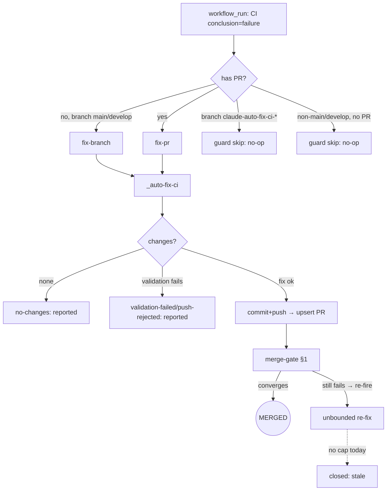
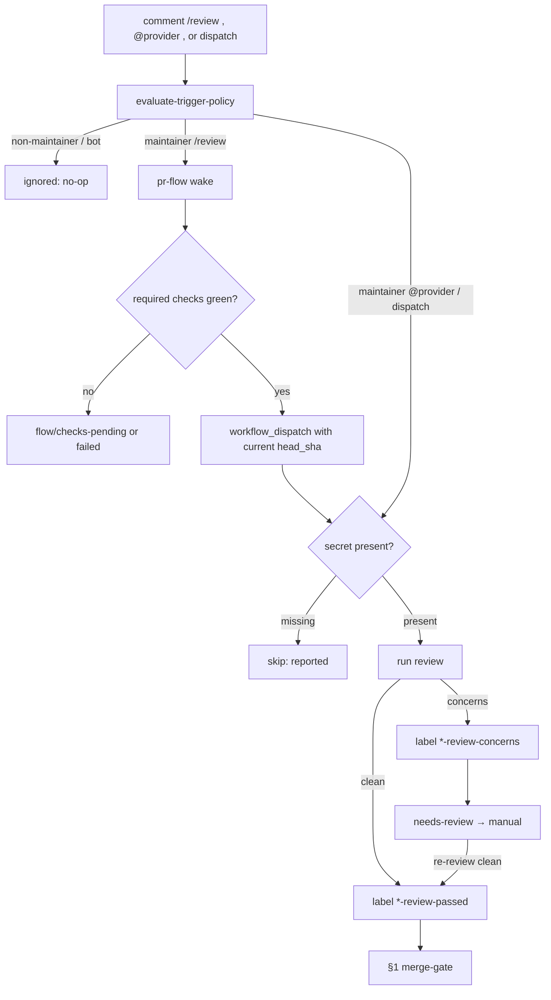
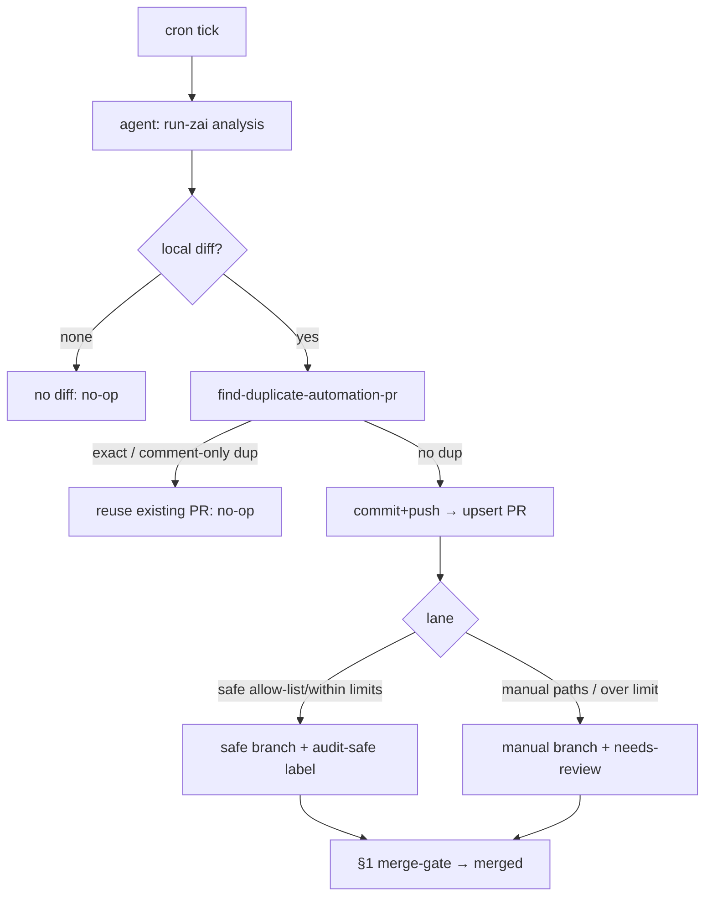
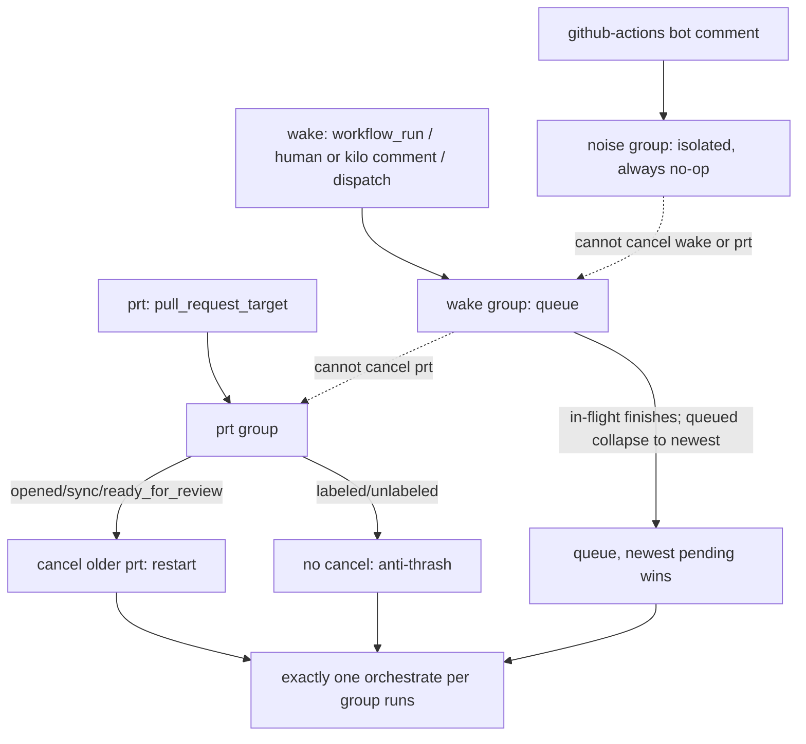
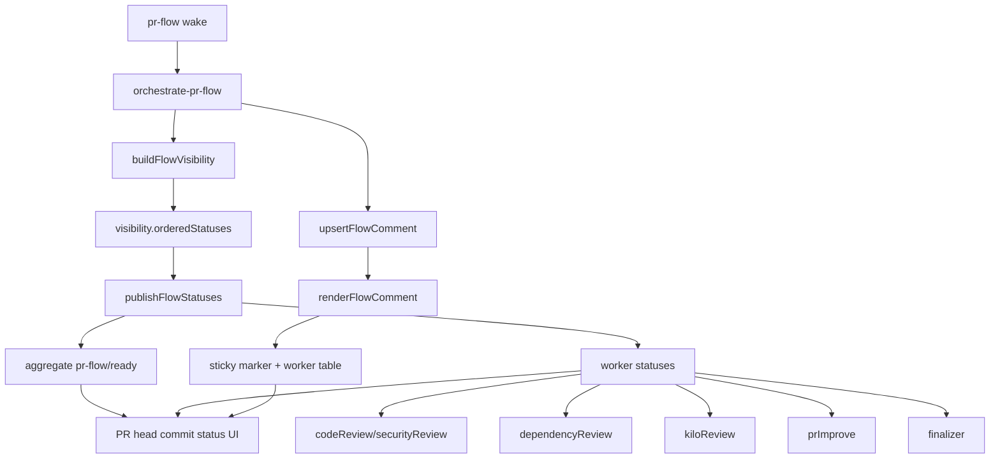
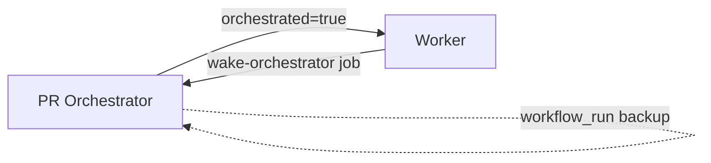
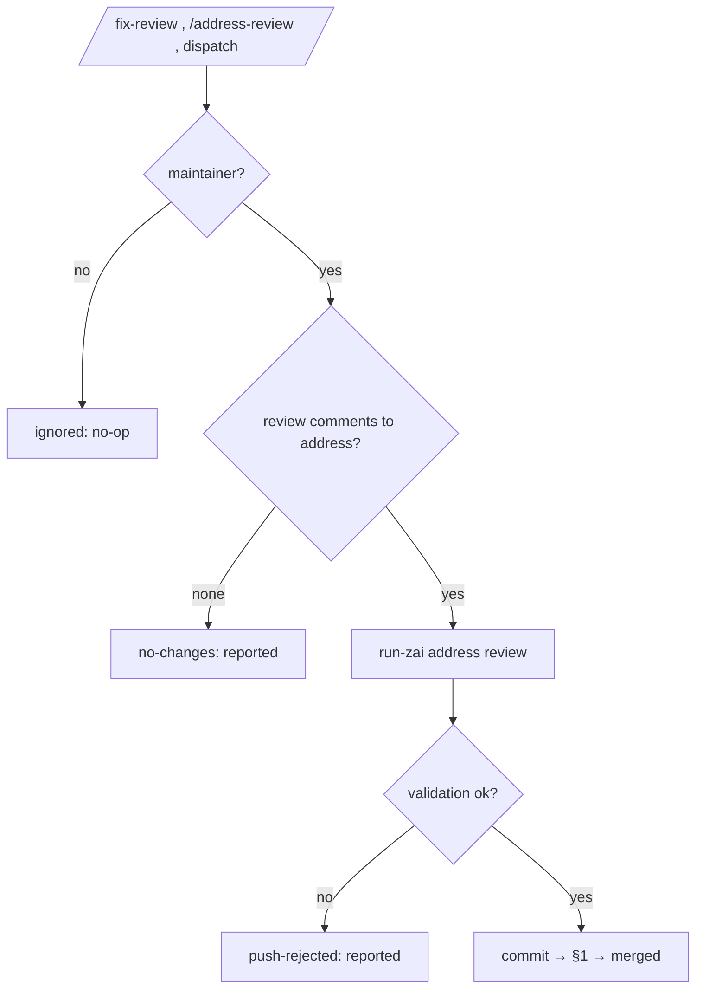
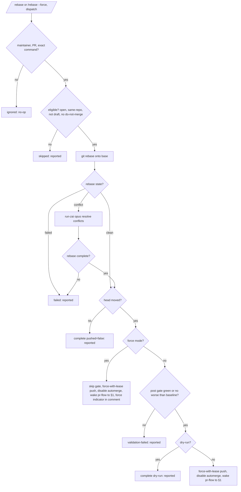

# Workflow E2E Scenario Catalog

Exhaustive end-to-end scenarios for the GitHub-workflow automation stack. **Every case is a full path: trigger → terminal.** Intermediate statuses (`awaiting_checks`, `blocked`, `manual_only`, `needs-review`) are waypoints, not endpoints — each carries a resolution arm to a terminal.

This catalog is the **spec for the characterization + spec test suite** (`scripts/__tests__/e2e-*.test.cjs`, run in CI via `ci.yml:61`) and the **validation surface for every future workflow change** (see `docs/code-standards.md` → "Workflow change protocol"). Glossary: `.github/workflows/CONTEXT.md`.

## How to read

- **char** — characterization test. Locks CURRENT behavior as a green regression baseline.
- **spec** — spec test. Asserts an INTENDED invariant; may be **red today**, drives a Phase-2 fix (TDD red→green). The `P0-x` tag names the fix.
- **TR** — tracked-red. Known gap, deferred, but recorded so it is _checked_ (visible / fail-loud).
- **char [verify]** — characterization whose exact outcome must be locked during the run (a code detail not yet fully traced).
- **Valid terminals:** `merged` · `closed` · `no-op`/`reported`.
- **Human-merge rule:** `manual_only` cases terminate at **`merged (human)`** — an _external_ terminal we trust (not asserted by the scripts). The 90-day `stale→close` fallback is documented but not modeled per-case. **Issue auto-closure** (`closes #N`) is a _post-merge side-effect_ noted only on automation-merge cases, never on human-merge cases.
- **Terminal model (hybrid):** the flow-simulator asserts the **terminal decision** the scripts emit (`approve_and_enable_automerge` ⇒ merged; a stale/close condition ⇒ closed). GitHub-side completion (auto-merge, human merge, stale close) is covered by separate narrow tests (`pr-finalizer.yml:128-153` merge step; `stale.yml` 60+30-day config), not mocked.

> Case outcomes are enumerated from each flow's decision-script branches; exact outputs are **locked by the characterization run** — if a row is subtly off, the test captures the real behavior and the row is corrected then.

---

## §1 Merge gate — `pr-finalizer.yml` (+ `pr-flow.yml`)

Decision basis: `evaluate-pr-finalizer-decision.cjs` (draft / hard-block / manual-review / manual-only / metadata / check-fail / pending / ready), `required-check-evidence.cjs` (success→pass / **skipped→skip/`skipping` (non-blocking; `gh pr checks` spells the bucket `skipping`)** / **cancelled→cancel (blocking)** / failure→fail / missing→pending), `policy.json` (`blockingLabels`, `manualOnlyBranchPrefixes`, `manualOnlyPathGlobs`, `generatedStatePathGlobs`, `trustedPlanning.requiredPassLabels`).

```mermaid
flowchart TD
  T[trigger: pr-flow wake<br/>label/comment/check/run] --> CL[pr-flow classify]
  CL -->|draft| D[awaiting_checks]
  CL -->|hard block label| BL[blocked]
  CL -->|needs-review / manualOnly| MO[manual_only]
  CL -->|checks pending/missing| AC[awaiting_checks]
  CL -->|checks pass + trusted| RD[approve_and_enable_automerge]
  D -->|ready_for_review| CL
  BL -->|unlabeled| CL
  BL -.->|stale 90d| X1[closed]
  MO -->|maintainer unlabeled / human merge| RD
  MO -.->|stale 90d| X1
  AC -->|check completes| CL
  RD --> M((MERGED))
  X1 -->((CLOSED))
```

| ID   | Trigger / precondition                                                                          | Resolution → terminal                                                                                                                                                                                                                                                                                                                                                                                                                                                                                                                                     | Type                                            |
| ---- | ----------------------------------------------------------------------------------------------- | --------------------------------------------------------------------------------------------------------------------------------------------------------------------------------------------------------------------------------------------------------------------------------------------------------------------------------------------------------------------------------------------------------------------------------------------------------------------------------------------------------------------------------------------------------- | ----------------------------------------------- |
| M1   | PR is draft                                                                                     | `ready_for_review` → orchestrate → M13                                                                                                                                                                                                                                                                                                                                                                                                                                                                                                                    | char                                            |
| M2   | hard block label (`do-not-merge`…)                                                              | `unlabeled` → re-gate; else stale→close                                                                                                                                                                                                                                                                                                                                                                                                                                                                                                                   | char                                            |
| M3   | `needs-review`, non-maintainer                                                                  | maintainer `unlabeled` → M13; else stale→close                                                                                                                                                                                                                                                                                                                                                                                                                                                                                                            | char                                            |
| M4   | `needs-review`, maintainer-approved                                                             | proceeds → M13                                                                                                                                                                                                                                                                                                                                                                                                                                                                                                                                            | char                                            |
| M5   | `manualOnlyBranchPrefixes` (`claude-audit-fix-`)                                                | human merge                                                                                                                                                                                                                                                                                                                                                                                                                                                                                                                                               | char                                            |
| M6   | `manualOnlyPathGlobs` (`.github/**`,`/.planning/**`)                                            | human merge                                                                                                                                                                                                                                                                                                                                                                                                                                                                                                                                               | char                                            |
| M7   | fork / cross-repo (untrusted scope)                                                             | human merge                                                                                                                                                                                                                                                                                                                                                                                                                                                                                                                                               | char                                            |
| M8   | `generatedStatePathGlobs` (`graphify-out/**`)                                                   | push removes files (`synchronize`)→re-gate; else close                                                                                                                                                                                                                                                                                                                                                                                                                                                                                                    | char                                            |
| M9   | required check **FAILED**                                                                       | blocked (no auto-merge)                                                                                                                                                                                                                                                                                                                                                                                                                                                                                                                                   | char                                            |
| M10  | required check **PENDING**                                                                      | check completes → M13 / M9                                                                                                                                                                                                                                                                                                                                                                                                                                                                                                                                | char                                            |
| M11  | required check **SKIPPED** (job-level)                                                          | `skip` bucket (non-blocking) → M13; `cancelled` still blocks                                                                                                                                                                                                                                                                                                                                                                                                                                                                                              | char (`required-check-evidence.cjs:86,185-191`) |
| M11b | `workflow_run` completed while `gh pr checks` is stale or sibling workflow is in-flight         | completed workflow-run jobs reconcile stale pending rows; skipped CI jobs stay non-blocking; in-flight sibling remains pending → M13                                                                                                                                                                                                                                                                                                                                                                                                                      | spec                                            |
| M12  | required check **MISSING** (whole wf path-filtered out)                                         | resolved via P0-1b: neither `CI` nor `PR Policy` filter at the trigger level; `ci.yml` instead gates heavy jobs behind a `changes` job so a docs-only PR still gets a (skipped, non-blocking) check entry → M13. A genuinely missing/misnamed required check still blocks (M10 pending / stale→close) — this is intentional, not a gap.                                                                                                                                                                                                                   | char (`workflow-triggers.test.ts` P0-1b)        |
| M13  | all review labels + checks pass + trusted                                                       | `approve_and_enable_automerge` → **merged**                                                                                                                                                                                                                                                                                                                                                                                                                                                                                                               | char                                            |
| M14  | all pass + untrusted branch                                                                     | manual_only → human **merged**                                                                                                                                                                                                                                                                                                                                                                                                                                                                                                                            | char                                            |
| M15  | missing `required_pass_label`                                                                   | AI review runs → `labeled *-passed` → M13                                                                                                                                                                                                                                                                                                                                                                                                                                                                                                                 | char                                            |
| M16  | auto-merge _enablement_ fails (`gh pr merge --auto`/`--approve` error)                          | status=failed, reported, PR open for human                                                                                                                                                                                                                                                                                                                                                                                                                                                                                                                | char                                            |
| M16b | finalizer decision `approve_and_enable_automerge`, apply step fails (e.g. merge token rejected) | failed run re-enters the bounded retry lane (`flow/finalizer-retry-N`, max 3) instead of parking on 'manual merge required'; cap → manual-only terminal. Merge itself runs with `GH_PAT` — with all checks already green `gh pr merge --auto` direct-merges (mergePullRequest), which GITHUB_TOKEN under contents:read cannot do, and a PAT merge lets the commit trigger on-push workflows on main. A failed apply also wakes the orchestrator (same wake job as success), so the retry lane fires immediately instead of waiting for an unrelated event | char                                            |
| M17  | mixed required-check states (pass + skipped + pending)                                          | pending dominates → awaiting → resolves on completion                                                                                                                                                                                                                                                                                                                                                                                                                                                                                                     | char                                            |
| M18  | auto-merge armed, later required check goes red                                                 | GitHub won't merge → re-enters blocked                                                                                                                                                                                                                                                                                                                                                                                                                                                                                                                    | char                                            |
| M19  | `dry_run` mode                                                                                  | decision-only, no approve/merge/comment                                                                                                                                                                                                                                                                                                                                                                                                                                                                                                                   | char                                            |

---

## §2 Auto-fix loop — `fix-branch.yml` / `fix-pr.yml` / `_auto-fix-ci.yml` (+ `approve-auto-fix.yml`)

Decision basis: `workflow_run` scoped to **`workflows: ['CI']`** (`fix-branch.yml:22`, `fix-pr.yml:25`) + failure/branch/PR guards (`fix-branch.yml:40-44`, `fix-pr.yml:43-44`), `_auto-fix-ci.yml` CI-matching gate + sticky statuses (`documentation.md:91-93`), `policy.json trustedAutomationBranchPrefixes`. The fix commit is gated by `validate-pr-gate` before push; a gate failure means no push (no fix PR).



| ID  | Trigger / precondition                                                                         | Resolution → terminal                                                                                                                                                | Type        |
| --- | ---------------------------------------------------------------------------------------------- | -------------------------------------------------------------------------------------------------------------------------------------------------------------------- | ----------- |
| A1  | CI fails on `main`/`develop`, no PR                                                            | fix-branch → `_auto-fix-ci` → fix PR → §1 → **merged**                                                                                                               | char        |
| A2  | CI fails on a PR                                                                               | fix-pr → `_auto-fix-ci` → push → CI re-run → §1 (**converges→merged** or **loops→A8**)                                                                               | char        |
| A3  | CI fails on `claude-auto-fix-ci-*` branch                                                      | guard `!startsWith` → **no-op** (loop guard)                                                                                                                         | char        |
| A4  | CI fails on non-main/develop, no PR                                                            | branch allow-list guard → **no-op**                                                                                                                                  | char        |
| A5  | CI **passes**                                                                                  | conclusion≠failure → not triggered → n/a                                                                                                                             | char        |
| A6  | fix produces no changes                                                                        | sticky `no-changes` → no commit → **reported**                                                                                                                       | char        |
| A7  | fix fails CI-matching gate before push                                                         | `validation-failed`/`push-rejected` → no push → **reported**                                                                                                         | char        |
| A8  | fix-PR's own CI keeps failing                                                                  | capped after `maxAutoFixAttempts` (3): evaluate-trigger-policy declines further runs → **reported** (no loop)                                                        | char (P0-2) |
| A9  | maintainer `/approve` on automation PR                                                         | approve-auto-fix → approve + auto-merge → **merged**                                                                                                                 | char        |
| A10 | non-CI workflow failure (review/dep/etc.)                                                      | fix-\* CI-scoped → **no-op** (no auto-fix)                                                                                                                           | char        |
| A11 | fix push disables auto-merge                                                                   | bot commit needs re-review → manual → **merged**                                                                                                                     | char        |
| A12 | linked CI-failure issue is an umbrella/tracking issue (e.g. rolling `[claude-health]` tracker) | `isTrackingIssue` filter → rendered as non-closing `Part of #N` instead of `Closes #N` → tracker **stays open after merge** (lib-missing fallback = legacy `Closes`) | char        |

---

## §3 AI-review label contract — `code-review`/`claude`/`antigravity(-code-review)`/`deepseek(-code-review)` (+ `dependency-review`)

Decision basis: `evaluate-trigger-policy.cjs` modes (`claude`/`antigravity`/`deepseek`/`*-review`) → `should_run`/`trusted`; secret checks (`DEEPSEEK_API_KEY`, `GEMINI_API_KEY`/`AV_API_KEY`, `ZAI_API_KEY`); label outputs (`*-review-passed`/`*-review-concerns`, `deps-review-{passed,manual,blocked}`). Provider is a **parameter** — providers sharing one label contract are one parametrized case, not duplicated.



| ID   | Trigger / precondition                                                               | Resolution → terminal                                                                                                                                    | Type          |
| ---- | ------------------------------------------------------------------------------------ | -------------------------------------------------------------------------------------------------------------------------------------------------------- | ------------- |
| R1   | maintainer `/review` on PR after required checks are green                           | pr-flow wake → `workflow_dispatch` with current `head_sha` → review → `*-review-passed` → §1 → **merged**                                                | char          |
| R1b  | maintainer `@provider` on PR (parametrized over provider)                            | provider review → `*-review-passed` → §1 → **merged**                                                                                                    | char          |
| R2   | review finds concerns                                                                | `*-review-concerns` → needs-review → manual                                                                                                              | char          |
| R3   | non-maintainer command                                                               | `should_run=false` (concurrency "ignored" branch) → **no-op**                                                                                            | char          |
| R4   | bot comment                                                                          | ignored branch → **no-op** (anti-loop)                                                                                                                   | char          |
| R5   | provider secret missing                                                              | check-secrets → skip → **reported**                                                                                                                      | char          |
| R6   | `@provider` on an **issue** (non-PR)                                                 | interactive agent responds (issue flow, not a gate)                                                                                                      | char          |
| R7   | `workflow_dispatch` orchestrated by pr-flow                                          | trusted → review runs → label → §1                                                                                                                       | char          |
| R7b  | manual `/review` after stale/cancelled current-head review and green required checks | stale review labels removed → Code Review redispatched by pr-flow → `flow/review-pending` until labels return                                            | spec          |
| R8a  | dependency-review: clean                                                             | `deps-review-passed` → §1 → **merged**                                                                                                                   | char          |
| R8b  | dependency-review: manual finding                                                    | `deps-review-manual` → manual (human decides); after 72h project-manager redispatches dependency review once per head, then escalates (PM34/PM32)        | char          |
| R8c  | dependency-review: blocked                                                           | `deps-review-blocked` → manual (human decides; **not** auto-close)                                                                                       | char          |
| R9   | review on a **draft** PR                                                             | not orchestrated → **no-op**                                                                                                                             | char          |
| R11  | antigravity secret fallback (`GEMINI_API_KEY` ∥ `AV_API_KEY`)                        | runs with whichever present → label                                                                                                                      | char          |
| R12  | review exceeds `MAX_TURNS`                                                           | truncated → label locked during run                                                                                                                      | char [verify] |
| R13  | Kilo current-head summary says `No Issues Found`                                     | `pr-flow/kilo-review=success` → PR Flow continues                                                                                                        | char          |
| R13b | Kilo sticky summary is edited after current head with `No Issues Found`              | edited sticky `<!-- kilo-review -->` wakes PR Flow → `pr-flow/kilo-review=success` → PR Flow continues                                                   | spec          |
| R14  | Kilo current-head summary or inline comments contain issues                          | `pr-flow/kilo-review=failure` → `flow/review-blocked`                                                                                                    | char          |
| R15  | Kilo issues are only on older head commits                                           | stale Kilo findings ignored → waits/passes based on current-head signal                                                                                  | char          |
| R16  | Kilo check is cancelled/skipped                                                      | `pr-flow/kilo-review=N/A` → PR Flow continues                                                                                                            | char          |
| R17  | no current-head Kilo reply under 30 minutes                                          | `pr-flow/kilo-review=pending` → `flow/review-pending`                                                                                                    | char          |
| R18  | no current-head Kilo reply after 30 minutes                                          | watchdog wakes PR Flow → `pr-flow/kilo-review=N/A` → PR Flow continues                                                                                   | char          |
| R19  | codeReview run fails for the current head, retries remain (< 3 total attempts)       | `flow/review-pending` → codeReview redispatched (retry N of 3)                                                                                           | char          |
| R20  | codeReview run fails for the current head, retries exhausted (3rd failure)           | `flow/review-failed` → advisory `antigravity-code-review.yml` dispatched once (informational only; merge gate still requires ai-/security-review-passed) | char          |

---

## §4 Autonomous-PR fleet — scheduled agents (`audit-fix`, `audit-auto-prs`, `suggest-improvements`, `docs-drift`, `monitor-…runs`, `workflow-health-optimize`, `issue-catch-up`, `gsd-planning-execute`, `maintenance`)

Decision basis: common pipeline `run-zai → prepare-automation-branch → find-duplicate-automation-pr → validate-pr-gate → commit-and-push → upsert-pull-request`; lane classification `classify-audit-fix.cjs` + `evaluate-pr-policy.cjs` (safe vs manual by path/count); `find-duplicate-automation-pr.cjs` (exact / comment-only dedup). `audit-fix` / `monitor-amnezia-control-panel-github-runs` / `workflow-health-optimize` gate their push on `validate-pr-gate` (`.github/actions/validate-pr-gate`); a gate failure posts a not-pushed summary instead of creating a PR.



| ID   | Trigger / precondition                                                                                                                                                                                                                                                                                                                                                                                    | Resolution → terminal                                                                                                                                                                                                                                                                                                                                                                                                                                                                                                                                                                                                                                                           | Type          |
| ---- | --------------------------------------------------------------------------------------------------------------------------------------------------------------------------------------------------------------------------------------------------------------------------------------------------------------------------------------------------------------------------------------------------------- | ------------------------------------------------------------------------------------------------------------------------------------------------------------------------------------------------------------------------------------------------------------------------------------------------------------------------------------------------------------------------------------------------------------------------------------------------------------------------------------------------------------------------------------------------------------------------------------------------------------------------------------------------------------------------------- | ------------- |
| P1   | agent diff, no duplicate (generic baseline)                                                                                                                                                                                                                                                                                                                                                               | create PR → classify lane → §1 → **merged** / manual                                                                                                                                                                                                                                                                                                                                                                                                                                                                                                                                                                                                                            | char          |
| P2   | diff exactly matches open PR                                                                                                                                                                                                                                                                                                                                                                              | `duplicate_found=exact` → **no-op** (dedup)                                                                                                                                                                                                                                                                                                                                                                                                                                                                                                                                                                                                                                     | char          |
| P3   | diff comment-only-equivalent                                                                                                                                                                                                                                                                                                                                                                              | `duplicate_found` (comment-only) → **no-op**                                                                                                                                                                                                                                                                                                                                                                                                                                                                                                                                                                                                                                    | char          |
| P4   | no local diff                                                                                                                                                                                                                                                                                                                                                                                             | "No local diff detected" → **no-op**                                                                                                                                                                                                                                                                                                                                                                                                                                                                                                                                                                                                                                            | char          |
| P5   | audit-fix within safe allow-list/limits                                                                                                                                                                                                                                                                                                                                                                   | `claude-audit-safe-fix-` + `audit-safe` → auto-merge → **merged**                                                                                                                                                                                                                                                                                                                                                                                                                                                                                                                                                                                                               | char          |
| P6   | audit-fix over limit / manual-only paths                                                                                                                                                                                                                                                                                                                                                                  | `claude-audit-fix-` + `needs-review` → manual                                                                                                                                                                                                                                                                                                                                                                                                                                                                                                                                                                                                                                   | char          |
| P7   | gsd-execute diff within `.planning/**` safe globs                                                                                                                                                                                                                                                                                                                                                         | trusted → §1 → **merged**                                                                                                                                                                                                                                                                                                                                                                                                                                                                                                                                                                                                                                                       | char          |
| P8   | gsd-execute diff outside safe globs                                                                                                                                                                                                                                                                                                                                                                       | manual-only paths → manual                                                                                                                                                                                                                                                                                                                                                                                                                                                                                                                                                                                                                                                      | char          |
| P9   | two agents run in same window                                                                                                                                                                                                                                                                                                                                                                             | mitigated by fleet back-pressure (P9b) + per-family title dedup + post-run patch dedup; a true cross-workflow mutex remains out of scope                                                                                                                                                                                                                                                                                                                                                                                                                                                                                                                                        | char          |
| P9b  | scheduled agent ticks while >=8 automation PRs (`claude-`/`claude/`/`codex/` heads) are open                                                                                                                                                                                                                                                                                                              | `check-pending-automation-pr.cjs` back-pressure trips -> run skipped (**no-op**, logged reason); manual `workflow_dispatch` bypasses the gate                                                                                                                                                                                                                                                                                                                                                                                                                                                                                                                                   | char          |
| P14  | >=2 recent failed runs show disk-exhaustion signatures (`No space left on device`/`ENOSPC`)                                                                                                                                                                                                                                                                                                               | monitor's scheduled run dispatches `cleanup-runner.yml` (npm + Next.js caches) instead of only reporting                                                                                                                                                                                                                                                                                                                                                                                                                                                                                                                                                                        | char          |
| PR721 | any report-failure job uses `if: failure()` instead of `always()` + result-check                                                                                                                                                                                                                                                                                                                          | grep-based e2e assertion scans all workflow YAMLs for report-failure jobs and rejects `if: failure()` — prevents timeout/cancelled blind spot regression across all consuming workflows                                                                                                                                                                                                                                                                                                                                                                                                                                                                                       | char          |
| P10  | agent updates an existing open PR on same branch                                                                                                                                                                                                                                                                                                                                                          | upsert (not create) → §1                                                                                                                                                                                                                                                                                                                                                                                                                                                                                                                                                                                                                                                        | char          |
| P11  | agent comments/labels-only (e.g. issue-catch-up clusters ≥3 similar issues)                                                                                                                                                                                                                                                                                                                               | comment / label / close duplicate issues (not a PR)                                                                                                                                                                                                                                                                                                                                                                                                                                                                                                                                                                                                                             | char [verify] |
| P11b | issue-catch-up `triaged_no_fix` issue with `auto_fix_eligible` (automation-authored, priority low/medium/high, no security/critical)                                                                                                                                                                                                                                                                      | `/fix` posted via GH_PAT (OWNER association passes trust gate) → §6a fix-issue flow; max 5 per run, 6h `/fix` cooldown                                                                                                                                                                                                                                                                                                                                                                                                                                                                                                                                                          | char          |
| P11c | issue-catch-up `triaged_no_fix` issue NOT `auto_fix_eligible` (security/critical, missing priority, or human-authored)                                                                                                                                                                                                                                                                                    | `needs-review` + manual-fix-triage comment (human terminal, unchanged)                                                                                                                                                                                                                                                                                                                                                                                                                                                                                                                                                                                                          | char          |
| P11d | dead-letter issue parked in `needs-review`/`triage-failed`, no `<!-- dead-letter-retry -->` marker, retry-eligible (triage kind, or fix kind meeting auto-fix rules), and past the cooldown: parked >7 days, OR every counted attempt is an inert bot comment (github-actions[bot]-authored, no `<!-- re-triage-dispatch -->` marker — no run ever started, so there is no transient failure to wait out) | one fresh-context retry: parking label(s) removed, marker comment posted (max 2 per run); fix kind re-issues `/fix`; triage kind takes no direct action — the next sweep re-buckets it `needs_retriage` and P11j dispatches; the retry marker resets the attempt counter so old attempts don't instantly re-park it                                                                                                                                                                                                                                                                                                                                                             | char          |
| P11e | dead-letter issue already carries the `<!-- dead-letter-retry -->` marker                                                                                                                                                                                                                                                                                                                                 | permanently parked - excluded from every catch-up bucket (human terminal)                                                                                                                                                                                                                                                                                                                                                                                                                                                                                                                                                                                                       | char          |
| P11f | umbrella/tracking issue (`isTrackingIssue` — `[todo-backlog]`/`[claude-health]`/`[GROUPED]` title, `backlog`/`keep-open`/`claude-health` label, or umbrella/rolling body marker) carries `canceled` or `duplicate`                                                                                                                                                                                        | fully exempt from every catch-up bucket incl. title-dedup — never auto-closed; agent prompt repeats the guard                                                                                                                                                                                                                                                                                                                                                                                                                                                                                                                                                                   | char          |
| P11g | hourly collect-issues step `umbrella-sub-issues.cjs --all --reconcile --spin-off` (before the agent sweep)                                                                                                                                                                                                                                                                                                | ticks umbrella checkboxes for sub-issues closed as completed, closes an umbrella only when EVERY item is ticked, then tops up sub-issues to the 3-open cap (dry_run honored); after spin-off it re-lists sub-issues and self-heals concurrent-race duplicates — closes extras as `not_planned` keeping the natively-linked (else lowest-numbered) child per TODO id; native link failures surface as `linkFailures` in the summary JSON and as a ⚠️ note in the `/fix` umbrella comment                                                                                                                                                                                         | char          |
| P11h | spun-off sub-issue (`umbrella-sub-issue` + `auto-fix` + priority label)                                                                                                                                                                                                                                                                                                                                   | born pre-triaged: spin-off applies `triaged` at creation and posts a deterministic "Triage Result" comment (backlog table is the classification source), `triage.yml` skips `issues: opened` for already-`triaged` issues, then catch-up Phase 6 auto-`/fix` (automation-authored, low/medium/high) → fix PR `Closes #sub` → sub-issue closes → P11g ticks the umbrella; the `umbrella-sub-issue` label makes `isTrackingIssue` return false, so catch-up/PM treat it as normal                                                                                                                                                                                                 | char          |
| P11i | triage post-label duplicate close sees an umbrella/tracking issue with the `duplicate` label                                                                                                                                                                                                                                                                                                              | `triage.yml` detects `isTrackingIssue` before `Close duplicate issues`; tracking issue is skipped and stays open                                                                                                                                                                                                                                                                                                                                                                                                                                                                                                                                                                | char          |
| P11j | issue-catch-up `needs_retriage` issue (no `triaged`, <2 counted attempts, 2h cooldown respected)                                                                                                                                                                                                                                                                                                          | deterministic collect-job step dispatches `triage.yml` via the workflow_dispatch API (GH_PAT) and posts the `<!-- re-triage-dispatch -->` marker ONLY after the dispatch call succeeds (a failed dispatch burns no attempt); liveness check warns when started runs < dispatches; the agent posts NO `/triage` comments — bot-authored command comments are inert because GITHUB_TOKEN events never start workflows                                                                                                                                                                                                                                                             | char          |
| P11k | issue-catch-up `triage_dead_letter` (≥2 counted attempts, still untriaged)                                                                                                                                                                                                                                                                                                                                | parked with `triage-failed` + "attempted 2x without success" comment — NEVER `needs-review`; `triage-failed` is not terminal for the PM issue queue, so project-manager `/fix` stays a recovery path (PM19d)                                                                                                                                                                                                                                                                                                                                                                                                                                                                    | char          |
| P11l | catch-up collect step finds a pipeline invariant violation (bot-authored `/fix`/`/triage` command comment, or triaged auto-fix issue with priority label and no PR after 24h)                                                                                                                                                                                                                             | recorded in `invariant_findings` (agent takes no action on it) and reported to the rolling `[claude-health] Issue-pipeline invariant findings` tracker; no findings → nothing posted; unchanged finding set → not re-posted (hash marker)                                                                                                                                                                                                                                                                                                                                                                                                                                       | char          |
| P11m | high/critical untriaged issue open >48h                                                                                                                                                                                                                                                                                                                                                                   | escalation is a fallback, never a shadow: routed AFTER comments fetch and dead-letter routing — a parked dead letter reaches P11d retry first (the early-continue form permanently stranded issue #759 behind hourly reminders); an unparked untriaged issue routes to P11j re-triage instead of a reminder; the "⚠️ Priority issue awaiting attention" nudge fires only where automated recovery declines (retry spent/cooling down, or manual `needs-review` park with no dead-letter comment); a parked untriaged issue is a human hold — it always exits before the recovery buckets, never re-triaged, even on sweeps where the daily nudge dedupe suppresses the reminder | char [verify] |
| P11n | priority-escalation reminder already posted within 24h                                                                                                                                                                                                                                                                                                                                                    | suppressed — the nudge is at most daily, not per hourly sweep (`shouldNudgePriority`)                                                                                                                                                                                                                                                                                                                                                                                                                                                                                                                                                                                           | char [verify] |
| P19  | claude-code-action attempt dies in prepare/branch setup with the git-auth signature (`could not read Username` / `Error in branch setup`, no execution output)                                                                                                                                                                                                                                            | retry classifier returns `fatal_config_git_auth` — deterministic config failure, remaining attempts are skipped; scan-claude-logs emits the `prepare_git_auth` finding and the actionable `prepare_failed_git_auth` failure reason (beats generic zero-turn reasons)                                                                                                                                                                                                                                                                                                                                                                                                            | char          |
| P19b | run-claude-params finishes with progress tracking enabled and failed attempts behind it                                                                                                                                                                                                                                                                                                                   | any "Claude Code is working…" comment for THIS run still showing the working banner is deleted (a successful attempt already edited its comment into the final report, so it never matches) — failed attempts stop accumulating in-progress banners                                                                                                                                                                                                                                                                                                                                                                                                                             | char          |
| P19c | structural invariant: a workflow combines `persist-credentials: false` with a `track-progress` value other than literal `'false'` while triggering on issues / issue_comment / pull_request*                                                                                                                                                                                                              | forbidden by `persist-credentials-hygiene.test.cjs` — tag-mode branch setup would fail at 0 turns before the agent runs (the regression that broke every `issues`-event triage run after PR #734)                                                                                                                                                                                                                                                                                                                                                                                                                                                                               | char          |
| P12  | dependabot PR                                                                                                                                                                                                                                                                                                                                                                                             | npm→auto; `github_actions/`→manual-only branch (`policy.json dependabot`)                                                                                                                                                                                                                                                                                                                                                                                                                                                                                                                                                                                                       | char          |
| P12b | dependabot github_actions bump, digest-only or patch of a SHA-pinned action                                                                                                                                                                                                                                                                                                                               | dependency-review dispatched via `.github/workflows/**` worker paths → `deps-review-passed` → PR becomes ready → PM manual-only 8h age-out + direct-merge review (PM14) → **merged**                                                                                                                                                                                                                                                                                                                                                                                                                                                                                            | char          |
| P12c | dependabot github_actions bump that unpins, jumps minor/major, or edits beyond `uses:` lines                                                                                                                                                                                                                                                                                                              | `deps-review-manual` → human merge                                                                                                                                                                                                                                                                                                                                                                                                                                                                                                                                                                                                                                              | char          |
| P13  | agent commits generated state (`graphify-out/**`)                                                                                                                                                                                                                                                                                                                                                         | blocked by `generatedStatePathGlobs`                                                                                                                                                                                                                                                                                                                                                                                                                                                                                                                                                                                                                                            | char          |
| P15  | `audit-auto-prs` succeeds with structured output carrying human dispositions / inspected PRs                                                                                                                                                                                                                                                                                                              | `publish-digest` job upserts the "Auto PR Audit: human-disposition digest" issue (create or refresh via title-search marker); external PR metadata in cells is pipe/newline/link-escaped; empty output clears the existing digest issue (no-op if none)                                                                                                                                                                                                                                                                                                                                                                                                                         | char          |
| P15b | `audit-auto-prs` job reaches its reporting tail (APR-E05 body-quality lint)                                                                                                                                                                                                                                                                                                                              | final `if: always()` step runs `lint-automation-pr-bodies.cjs` over open automation PRs and appends the offender report to `$GITHUB_STEP_SUMMARY`; report-only (`continue-on-error` + script `|| true`) so a bad body never aborts the scheduled audit — merge-time gating is a separate required `pr-policy/*` status, not this scheduled job | char          |
| P15c | `audit-auto-prs` orphan-branch check (APR-E08)                                                                                                                                                                                                                                                                                                                                                           | `cleanup-orphan-branches.cjs --dry-run true` runs as `if: always()` + `continue-on-error`, writes orphan count to `$GITHUB_STEP_SUMMARY`; when count > 5, a subsequent step dispatches `auto-pr-branch-cleanup.yml` with `dry-run=false` to delete stale automation branches | char          |
| APR-E10a | first `audit-auto-prs` run recommends a systemic fix | `publish-digest` persists one recommendation-log entry; no escalation issue is opened before the consecutive-run threshold | char |
| APR-E10b | a clean audit occurs between two audits recommending the same systemic fix | the clean run is persisted with an empty recommendation list and resets the streak; the later recommendation does not escalate | char |
| APR-E10c | two consecutive distinct audit runs recommend the same systemic fix | the second run opens one fingerprinted tracking issue; a workflow retry resumes incomplete processing without appending or counting the run twice | char |
| APR-E10d | a merged PR references the fingerprint or closes the prior escalation issue | merged-fix suppression recognizes the implementation and does not reopen/escalate the recommendation | char |
| APR-I09a | `run-zai` / `run-claude` caller sets `allowed-bots-profile: orchestrated` (or `interactive`) | `resolve-allowed-bots.cjs` reads `policy.json` `allowedBots.profiles`; `github-actions` and `github-actions[bot]` stay distinct exact logins; unknown profile / wildcard / empty list fail closed | char |
| APR-I09b | caller passes an explicit `allowed-bots` override (triage + kilo-code-bot) | override wins over profile; still rejects wildcards; repository contract test fails if other workflows reintroduce hardcoded comma lists | char |
| MON-E04a | hourly run monitor finds a first-attempt failed run with a deterministic transient signature | preflight invokes `rerun-transient-failed-runs.cjs` with `monitor_since`, requests one failed-job rerun, and emits a versioned recovery ledger whose `rerunRequested` entry means dispatch accepted rather than recovery succeeded | char |
| MON-E04b | a failed run log contains an incidental transient warning plus a permanent compiler/test signature | permanent-error precedence classifies the run as non-transient; no automatic rerun is requested and AI diagnosis remains available | char |
| MON-E04c | a MON-E04 rerun is queued or in progress when the agent surveys it | run remains in the survey as `recovery-pending`; the agent reports it without proposing a code fix yet | char |
| MON-E04d | a MON-E04 rerun completes successfully | run remains in the survey as `recovered-transient`; the original transient failure does not become a code-fix proposal | char |
| MON-E04e | a MON-E04 rerun fails with deterministic compiler, lint, test, or configuration evidence | agent compares the original and rerun attempts and treats the run as a `structural code-fix candidate` | char |
| MON-E04f | a MON-E04 rerun fails again with only the same transient signature | agent classifies a `repeated-transient reliability incident`, reports it, and does not propose a code fix without structural evidence | char |
| MON-E04g | recovery ledger is absent, invalid, unsupported, or reports an error | agent applies normal evidence-first diagnosis and suppresses no run or code-fix candidate | char |
| MNT-E02a | daily maintenance scans schedule-triggered runs | `detect-schedule-drift.cjs` parses fixed, list, wildcard-step, range, and range-step cron slots; malformed fields are ignored instead of becoming partial numeric slots | char |
| MNT-E02b | schedule-drift collection or summary rendering fails | the observability step is `continue-on-error`; daily maintenance continues, while successful probes append drift telemetry and warning annotations to the step summary | char |
| P16  | maintenance prunes stale resolved debug docs                                                                                                                                                                                                                                                                                                                                                              | prepared `claude-maintenance-` branch → validate → commit/push → maintenance PR                                                                                                                                                                                                                                                                                                                                                                                                                                                                                                                                                                                                 | char          |
| P17  | maintenance changes present but validation gate fails                                                                                                                                                                                                                                                                                                                                                     | `gate_passed=false` → maintenance job fails (`exit 1`) → `report-failure` opens a `maintenance`/`ci-failure` issue + triage dispatch; changes not pushed, no PR                                                                                                                                                                                                                                                                                                                                                                                                                                                                                                                 | char          |
| P18  | docs-drift run creates a fresh draft PR while older `claude-workflow-optimize-docs-drift-*` drafts are still open                                                                                                                                                                                                                                                                                         | older drafts are superseded: comment linking the replacement + `gh pr close` (branch kept; best-effort — a failed close warns but never fails the run); combined with PM62 draft aging, drafts no longer accumulate as a dead state                                                                                                                                                                                                                                                                                                                                                                                                                                             | char          |
| P18b | docs-drift run finds no drift while old `claude-workflow-optimize-docs-drift-*` drafts (>7 days) are open                                                                                                                                                                                                                                                                                                 | clean re-audit closes the stale drafts too (comment + close, branch kept, best-effort) — the supersede path no longer requires a new report to fire                                                                                                                                                                                                                                                                                                                                                                                                                                                                                                                             | char          |
| WHO-E01a | `workflow-health-optimize` collect-runs persists per-run health summaries as JSONL (persist-health-summary.cjs) | run summaries written to `health-summary-<timestamp>.jsonl` in cwd; `summary_path` output set only when persist returns non-null; upload-artifact step uploads `health-summary-${{ github.run_id }}` with 7-day retention; `if-no-files-found: ignore` | char |
| WHO-E01b | `workflow-health-optimize` collect-runs with empty runSummaries | persistHealthSummary returns null → `summary_path` output not set → upload-artifact skipped (guard `summary_path != ''`) → no artifact uploaded, no error | char |

---

## §5 Cancellation cascade — `pr-flow.yml` prt/wake/noise concurrency

Decision basis: `pr-flow.yml` concurrency block (prt vs wake vs noise **isolated** groups; `cancel-in-progress` **true only for prt state changes** — prt `labeled`/`unlabeled` and all reactive wakes never cancel an in-flight run), `workflow-triggers.test.ts` guardrails, `documentation.md` concurrency section. GitHub applies concurrency cancellation at run creation, before job `if:` gates run, so a run that will end up all-skipped still cancels/displaces group members — that is why no-op bot comments get their own `noise` group instead of relying on the classify gate.



| ID   | Trigger / precondition                                                                                                  | Resolution → terminal                                                                                                                                                                                                                                                                                                                          | Type                                |
| ---- | ----------------------------------------------------------------------------------------------------------------------- | ---------------------------------------------------------------------------------------------------------------------------------------------------------------------------------------------------------------------------------------------------------------------------------------------------------------------------------------------- | ----------------------------------- |
| C1   | prt `opened`/`synchronize`/`ready_for_review`/`reopened`                                                                | `cancel-in-progress=true` → newer prt cancels older (restart on new commit)                                                                                                                                                                                                                                                                    | char                                |
| C2   | prt vs wake                                                                                                             | isolated groups (`prt-<PR#>` vs `wake-<PR#>`) → a wake can never cancel an in-flight prt                                                                                                                                                                                                                                                       | char                                |
| C3   | prt `labeled`/`unlabeled`                                                                                               | `cancel-in-progress=false` → does NOT cancel in-flight prt (anti-thrash: orchestrate itself adds `flow/*` labels)                                                                                                                                                                                                                              | char                                |
| C4   | wake (workflow_run / human or kilo comment / dispatch)                                                                  | `cancel-in-progress=false` → an in-flight wake (even one queued for a runner) always finishes; queued wakes collapse newest-wins via GitHub pending-run replacement                                                                                                                                                                            | char                                |
| C5   | label loop (orchestrate adds `flow/*` → `labeled`)                                                                      | C3 ⇒ no cancel ⇒ no flood (the cascade fix)                                                                                                                                                                                                                                                                                                    | char                                |
| C6   | prt terminal conclusion                                                                                                 | must never be wrongly `cancelled` (green/skipped) — consequence of C2+C3                                                                                                                                                                                                                                                                       | **spec** (PR #434 regression guard) |
| C7   | wake source parametrized (workflow_run / comment / dispatch)                                                            | all queue via C4                                                                                                                                                                                                                                                                                                                               | char                                |
| C8   | worker-completion wake (e.g. Code Review `workflow_run` completed)                                                      | re-orchestrate → dispatch next worker                                                                                                                                                                                                                                                                                                          | char                                |
| C9   | expired `pr-flow/kilo-review` pending status                                                                            | `pr-flow-watchdog` dispatches PR Flow so the 30-minute Kilo skip is applied                                                                                                                                                                                                                                                                    | char                                |
| C12  | `issue_comment` authored by `github-actions[bot]` (sticky-comment upserts, PM state)                                    | routed to isolated `pr-flow-noise-<PR#>` group + filtered by classify `if:` → zero-runner skipped run that can never cancel or displace a real wake (the PR #695 stuck-at-`flow/checks-pending` fix)                                                                                                                                           | **spec** (stuck-flow regression)    |
| C13  | `pr-flow/ready` commit status pending for ≥30 min                                                                       | `pr-flow-watchdog` selects the PR (`stale-ready-pending`) and re-dispatches PR Flow — rescues a PR whose reactive wake was lost after checks completed; idempotent when checks are genuinely still running                                                                                                                                     | char (`watch-pr-flow.test.cjs`)     |
| C13b | head's status history shows ≥8 pending `pr-flow/ready` aggregates (`ready-pending-loop`)                                | the re-poke loop is making no progress: watchdog still re-dispatches but also labels the PR `pm-escalation` so a human sees the stuck PR instead of silent 30-min retries                                                                                                                                                                      | char (`watch-pr-flow.test.cjs`)     |
| C13c | `pr-flow/ready` in **failure** for ≥30 min while the PR carries `flow/finalizer-dispatched` (`stale-finalizer-failure`) | a failed finalizer apply parks on a failure aggregate that the pending-only rescue never saw; watchdog re-pokes so the orchestrator's bounded retry lane can advance it. Scoped to the finalizer label — `flow/checks-failed` PRs stay in PM's /fix lane; stops once the retry cap flips the state to manual-only (terminal success aggregate) | char (`watch-pr-flow.test.cjs`)     |
| C10  | `auto-cover-review` scan mode (schedule / unresolved `workflow_run` / empty dispatch)                                   | all scan-mode runs share one `auto-cover-review-scan` group (`cancel-in-progress=true`) so overlapping scans never both pass the eventually-consistent active-run check and dispatch duplicate `fix-review` runs (targeted single-PR paths still get per-PR groups)                                                                            | char                                |
| C10b | `auto-cover-review` `issue_comment` authored by `github-actions[bot]` (sticky-comment upserts, worker reports)          | routed to isolated `auto-cover-review-noise-<PR#>` group + `cancel-in-progress=false` → zero-runner skipped run that can never cancel or displace a real fix-review wake (same bug class as C12, PR #715 fix applied to auto-cover-review)                                                                                                     | char                                |
| C11  | per-PR fetch failure during a scan                                                                                      | `fetch-auto-cover-context` isolates the failed PR (skipped + recorded in manifest; not handed to the dispatch loop) so the rest of the scan completes; only the shared `fix-review` runs fetch failing or EVERY PR failing aborts the job (retry next cycle)                                                                                   | char                                |

---

## §5b Commit-status visibility — `pr-flow.yml` orchestrate → `buildFlowVisibility` → `publishFlowStatuses` + `upsertFlowComment`

Decision basis: `orchestrate-pr-flow.cjs` `buildFlowVisibility` (aggregate `pr-flow/ready` + per-worker statuses), `publishFlowStatuses` (gh api `statuses/{sha}`), `upsertFlowComment` (sticky marker `<!-- pr-flow-orchestration -->`), `pr-flow.json` statuses section (contexts + descriptions). Visibility runs after dispatch+label sync; errors aggregate into status.



| ID  | Trigger / precondition                                              | Resolution → terminal                                                                                                                                 | Type |
| --- | ------------------------------------------------------------------- | ----------------------------------------------------------------------------------------------------------------------------------------------------- | ---- |
| V1  | Initial orchestration on draft PR                                   | aggregate=pending, all workers=pending → PR comment shows waiting state                                                                               | char |
| V2  | Worker completion wake (e.g., Code Review `workflow_run` completed) | re-orchestrate → buildFlowVisibility → updated statuses (codeReview=success) → old PR comment is deleted and refreshed as the latest timeline comment | char |
| V3  | Worker dispatch fails (`gh workflow run` error)                     | aggregate=error, relevant worker=error → status describes failure → PR comment surfaces dispatch error                                                | char |
| V4  | Required checks failed                                              | aggregate=failure, workers pending → `pr-flow/ready` blocks merge                                                                                     | char |
| V5  | Review passed (`ai-review-passed` + `security-review-passed`)       | workers=success, aggregate=pending (waiting for finalizer) → PR comment shows review success                                                          | char |
| V6  | Draft → ready transition                                            | statuses refresh from pending to active state → replacement PR comment shows next steps as latest timeline comment                                    | char |
| V7  | Closed/merged PR                                                    | aggregate=success, workers=N/A → final statuses set, PR comment shows terminal state                                                                  | char |
| V8  | Manual-only policy (`needs-review` label)                           | aggregate=success, finalizer=N/A → `pr-flow/ready` passes, PR comment shows manual-only gate                                                          | char |
| V9  | Visibility publish fails (gh api error)                             | error logged, aggregate status updated with error description → PR comment may stale, but status surfaces failure                                     | char |
| V10 | Dependency review required (dependabot + package.json changed)      | dependencyReview active (not skipped), codeReview=N/A → statuses reflect dependency gate                                                              | char |
| V11 | Multiple workers running concurrently                               | each worker shows `running` displayState → PR comment table shows live progress                                                                       | char |
| V12 | External Kilo review pending (no current-head reply under 30min)    | kiloReview=pending → `pr-flow/kilo-review` status shows waiting → PR Flow continues to other gates                                                    | char |

---

## §5c Worker wake-up contract — dispatch chain rule

Decision basis: Every worker dispatched by the orchestrator (`orchestrated=true`) must wake `pr-flow.yml` after completing, so the orchestrator re-evaluates and advances the flow. `workflow_run` on `pr-flow.yml` remains a backup path. Invariant enforced by `worker-wake-invariant.test.cjs`.

### Contract requirements

Each dispatched worker (listed in `pr-flow.json` `workers` with a `workflow:` field) must:

1. **`actions: write`** at the top-level `permissions` block — required for `gh workflow run`.
2. **`orchestrated`** boolean input in `workflow_dispatch.inputs` — set by the orchestrator to `true`.
3. **`wake-orchestrator` job** — runs `always()` after all worker jobs, gated on `orchestrated == 'true'` and `pr_number != ''`, dispatches `pr-flow.yml` with `dry_run=false`.



| ID  | Trigger / precondition                           | Resolution → terminal                                                                   | Type |
| --- | ------------------------------------------------ | --------------------------------------------------------------------------------------- | ---- |
| WC1 | Dispatched worker completes (success or failure) | `wake-orchestrator` job fires `gh workflow run pr-flow.yml` → orchestrator re-evaluates | char |
| WC2 | Worker missing `actions: write`                  | `gh workflow run` fails silently → orchestrator never re-woke                           | spec |
| WC3 | Worker missing `orchestrated` input              | wake gate (`orchestrated == 'true'`) never passes → stale flow                          | spec |
| WC4 | Worker missing `wake-orchestrator` job           | only `workflow_run` backup path remains — reliable but slower (polls every ~5min)       | spec |
| WC5 | Manual run (not orchestrated)                    | `orchestrated` defaults to `false` → wake-orchestrator skipped → no re-dispatch         | char |

### Dispatched workers and their wake-up status

| Worker                | Workflow                      | `actions: write` | `orchestrated` input | `wake-orchestrator` |
| --------------------- | ----------------------------- | ---------------- | -------------------- | ------------------- |
| codeReview            | `code-review.yml`             | ✓                | ✓                    | ✓                   |
| dependencyReview      | `dependency-review.yml`       | ✓                | ✓                    | ✓                   |
| prImprove             | `pr-improve.yml`              | ✓                | ✓                    | ✓                   |
| finalizer             | `pr-finalizer.yml`            | ✓                | ✓                    | ✓                   |
| antigravityCodeReview | `antigravity-code-review.yml` | ✓                | ✓                    | ✓                   |

---

## §6a Issue → `/fix-issue` → PR — `fix-issue.yml`

Decision basis: `evaluate-trigger-policy.cjs --mode fix-issue` (`maintainerTriggeredFix` / `labelTriggeredFix`), guard `issue.pull_request == null` (`fix-issue.yml:27-33`). Push is gated by `validate-pr-gate` (`fix-issue.yml`); a gate failure means no fix PR is created.

| ID  | Trigger / precondition                                                                                                                                                                                                    | Resolution → terminal                                                                                                                                                                                                                                                                         | Type |
| --- | ------------------------------------------------------------------------------------------------------------------------------------------------------------------------------------------------------------------------- | --------------------------------------------------------------------------------------------------------------------------------------------------------------------------------------------------------------------------------------------------------------------------------------------- | ---- |
| F1  | maintainer `/fix-issue` on issue                                                                                                                                                                                          | gate → run-zai fix → `claude-fix-issue-` PR (body `closes #N`) → §1 → **merged** _(side-effect: linked issue auto-closes on merge)_                                                                                                                                                           | char |
| F2  | non-maintainer `/fix-issue`                                                                                                                                                                                               | `should_run=false` → **no-op**                                                                                                                                                                                                                                                                | char |
| F3  | fix-trigger label on issue                                                                                                                                                                                                | label-triggered fix → PR → §1 → **merged**                                                                                                                                                                                                                                                    | char |
| F4  | fix produces no changes                                                                                                                                                                                                   | `no-changes` → **reported**                                                                                                                                                                                                                                                                   | char |
| F5  | fix validation fails                                                                                                                                                                                                      | `push-rejected`/`validation-failed` → **reported**                                                                                                                                                                                                                                            | char |
| F6  | `/fix-issue` on a **PR-linked** issue                                                                                                                                                                                     | `pull_request==null` guard → **no-op**                                                                                                                                                                                                                                                        | char |
| F7  | `/fix` on an **umbrella/tracking** issue with a checklist (title `[todo-backlog]`/`[claude-health]`/`[GROUPED]`, `backlog`-family label, or "Umbrella tracking issue"/"rolling issue" body — `detect-tracking-issue.cjs`) | NO agent run: `umbrella-sub-issues.cjs --reconcile --spin-off` ticks completed items, spins off up to 3 open sub-issues (priority order, native sub-issue link, `auto-fix`+`umbrella-sub-issue`+priority labels), comments the result; NO `fixed`/`canceled` labels → umbrella **stays open** | char |
| F8  | `/fix` on a tracking issue with NO parseable checklist (e.g. rolling `[claude-health]` tracker)                                                                                                                           | script no-ops → "does not act on tracking issues without a checklist" comment; NO `canceled` label → **reported**                                                                                                                                                                             | char |
| F9  | fix adds new `.github/workflows/scripts/*.{cjs,mjs,js,sh}` but does **not** modify any `.github/workflows/*.yml` (orphaned script — wiring gate)                                                                            | `wired=false` → gate/push skipped → no PR created; `::error::` annotation listing unwired scripts; issue gets `needs-review` label + run-link comment (NOT `canceled`, since the agent *did* produce changes); `needs-review` blocks auto-re-fix until a human wires the script(s) | char |

## §6b GSD `/plan` → PR (+ execute) — `gsd-planning.yml` / `gsd-planning-execute.yml` / `planning-intake-repair.yml`

Decision basis: `evaluate-pr-policy.cjs` `gsdExecution` (`safeAllowedPathGlobs`, `manualOnlyPathGlobs`), `policy.json trustedPlanning` (`.planning/**`, `requiredPassLabels`). Lane classification for execute-PRs is shared with §4 P7/P8.

| ID  | Trigger / precondition                                                                                                                         | Resolution → terminal                                                                                                                                                                                                                                                                 | Type          |
| --- | ---------------------------------------------------------------------------------------------------------------------------------------------- | ------------------------------------------------------------------------------------------------------------------------------------------------------------------------------------------------------------------------------------------------------------------------------------- | ------------- |
| G1  | maintainer `/plan` / dispatch on issue                                                                                                         | plan → `claude-planning-pr-` PR (`.planning/**`) → trusted → §1 → **merged**                                                                                                                                                                                                          | char          |
| G2  | planning PR touches paths outside `.planning/**`                                                                                               | manual-only paths → manual                                                                                                                                                                                                                                                            | char          |
| G3a | `gsd-planning-execute` cron (6h), implementation changes detected                                                                              | execute run → execution PR created (lane classified per P7/P8) → §1                                                                                                                                                                                                                   | char          |
| G3b | `gsd-planning-execute` cron (6h), no implementation changes detected but planning/state persistence exists                                     | no-op persistence PR created (`chore(planning): track execution queue plan`, `gsd-plan-execution`, `skip-improve`) → §1                                                                                                                                                               | char          |
| G4  | execute validation fails                                                                                                                       | `continue-on-error` loops → report-failure or commit _(lock during run)_                                                                                                                                                                                                              | char [verify] |
| G5  | `/planning-rename-milestones`                                                                                                                  | `planning-intake-repair` → commit/PR                                                                                                                                                                                                                                                  | char          |
| G6  | `gsd-planning-execute` cron, oldest eligible `gsd-deferred-proposal` issue exists (no security/critical/keep-open/in-progress, non-empty body) | `promote-deferred-proposal.cjs` writes `.planning/quick/deferred-issue-<n>-plan.md` → `claude-planning-pr-deferred-*` PR (trustedPlanning path) → §1 → **merged** → next executor run imports it into Phase 999; source issue labeled `in-progress` and closed by the PR's `Fixes #n` | char          |
| G7  | deferred-proposal issue is security/critical/keep-open, already `in-progress`, or has an empty body                                            | not selected — stays a human-review terminal                                                                                                                                                                                                                                          | char          |
| G8  | `planning-intake-open` promotion PR closed **without** merging (`auto-pr-branch-cleanup.yml` `pull_request: closed`)                           | `restore-deferred-proposal` job parses the source issue from the PR body, removes `in-progress`, restores `needs-review`, and comments → issue is re-selectable on the next cron (no stranded `in-progress` dead-end)                                                                 | char          |

## §6c Release → release-notes — `release-notes.yml`

Decision basis: release trigger → `run-zai` → notes (not a PR-merge flow).

| ID  | Trigger / precondition | Resolution → terminal                                                                           | Type          |
| --- | ---------------------- | ----------------------------------------------------------------------------------------------- | ------------- |
| N1  | release published      | `run-zai` → notes posted _(target: release/PR-comment/asset — lock during run)_ → **published** | char [verify] |
| N2  | ZAI fails during notes | report-failure → **reported**                                                                   | char          |

## §6d `/fix-review` · `/address-review` → PR — `fix-review.yml`

Decision basis: `fix-review.yml` issue_comment (`/fix-review`,`/address-review`) + `workflow_dispatch`; concurrency "ignored" branch; ZAI address-review → commit. Distinct command-driven fix flow (not folded into §3). Push is gated by `validate-pr-gate` (`id: gate`); a `detect-noop` step skips the gate+push and posts `renderNoChanges` when the agent changed nothing. `detect-noop` counts only pushable changes: `.claude-pr/` (runtime artifact) and `.github/actions/` (force-restored before commit) are excluded so those edits never leave runs in limbo (has_changes=true, nothing pushed, no retrigger). Agent edits confined to the protected set set a second output, `restored_only=true`: the summary posts `renderProtectedPathsOnly` ("fix limited to protected paths") instead of `renderNoChanges`, and the false-positive code-review retrigger is suppressed, because a reverted real fix is not a confirmed false positive (previously this state re-greenlit the PR while its finding was silently discarded). The maintainer can opt in to committing `.github/actions/` edits — persistently via the policy-defined `allow-protected-edits` PR label (`policy.protectedEditsLabel`, checked by `evaluate-fix-review-eligibility.cjs` for every trigger source) or one-shot via `/fix-review --allow` / the `allow_protected_edits` dispatch input (parsed by `evaluate-trigger-policy.cjs`). With the opt-in, only `validate-pr-gate/` and `commit-and-push/` stay force-restored (the workflow executes those two with credentials after the agent, so their definitions are never committable from this flow); everything else under `.github/actions/` goes through the normal gate + push + re-review. The restore step also `git clean`s untracked files under the protected set so `commit-and-push`'s `git add -A` cannot stage agent-created files that change detection excluded. A gate failure posts a dual-block summary (agent-reported vs authoritative gate) and does not push. A skipped run posts `renderSkipped` carrying a machine-readable `<!-- fix-review-skip-reason: <code> -->` tag (from `evaluate-fix-review-eligibility.cjs`'s `skip_reason_code`); a stale dispatch stamps the expected (abandoned) SHA rather than the live head, so `auto-cover-review`'s same-head skip check — which trusts only `github-actions[bot]` authorship — never permanently suppresses an eligible automated repair: only immutable codes (`merged`, `cross-repo`) — which cannot flip eligible without a new commit — suppress; every mutable code (`not-open`, `draft`, `hard-blocker`, `stale`, `requires-automation-loop`) and legacy/missing codes do not, because the underlying state can change without a new head (reopen / ready-for-review / label removal) and auto-cover re-validates each condition live every cycle.



| ID   | Trigger / precondition                                                                             | Resolution → terminal                                                                                                                                                                                                                                                             | Type |
| ---- | -------------------------------------------------------------------------------------------------- | --------------------------------------------------------------------------------------------------------------------------------------------------------------------------------------------------------------------------------------------------------------------------------- | ---- |
| FR1  | maintainer `/fix-review`/`/address-review` on PR                                                   | ZAI address review → detect-noop → validate-pr-gate → commit → §1 → **merged**                                                                                                                                                                                                    | char |
| FR2  | non-maintainer command                                                                             | ignored branch → **no-op**                                                                                                                                                                                                                                                        | char |
| FR3  | no review comments to address                                                                      | `no-changes` → **reported**                                                                                                                                                                                                                                                       | char |
| FR4  | ZAI fix fails validation                                                                           | `push-rejected` → **reported**                                                                                                                                                                                                                                                    | char |
| FR5  | agent changed nothing (no findings / clean tree)                                                   | `detect-noop` `has_changes=false` → `renderNoChanges`, no push → **reported**                                                                                                                                                                                                     | char |
| FR6  | `validate-pr-gate` fails                                                                           | `FIX-REVIEW Report` dual-block summary (agent-reported vs authoritative gate), not pushed → **reported** (re-run to retry)                                                                                                                                                        | char |
| FR7  | internal AI/security concerns on an eligible PR                                                    | `auto-cover-review` dispatches `fix-review` automation mode and reports both dispatcher + fix-review run links → gated push → §3 review rerun                                                                                                                                     | char |
| FR8  | Kilo-only current-head blocker                                                                     | `auto-cover-review` dispatches `fix-review` automation mode and reports both dispatcher + fix-review run links → gated push → §3 review rerun                                                                                                                                     | char |
| FR9  | manual-only PR with review blockers                                                                | repair is allowed, but finalizer/auto-merge stay blocked by manual-only policy                                                                                                                                                                                                    | char |
| FR10 | auto-cover attempt cap reached                                                                     | no new `fix-review` dispatch → **reported/no-op**                                                                                                                                                                                                                                 | char |
| FR11 | active current-head `fix-review` run exists                                                        | no duplicate dispatch → **no-op**                                                                                                                                                                                                                                                 | char |
| FR12 | maintainer `/fix-review` on GSD PR where internal review passed but Kilo says address before merge | Unresolved, non-outdated Kilo review-thread issues/warnings/suggestions are collected as actionable feedback and repair is allowed; after gated push or no-change report, PR Flow still requires both reviews to pass and keeps manual-only / human merge when policy requires it | char |
| FR13 | `/fix-review` cannot fetch review-thread feedback from GitHub GraphQL                              | feedback collection fails closed instead of producing a partial bundle, because a missing thread section can falsely report no actionable inline Kilo findings                                                                                                                    | spec |
| FR14 | agent's only edits are under `.github/actions/` (force-restored before commit), no opt-in          | `detect-noop` `restored_only=true` → `renderProtectedPathsOnly` summary offering `/fix-review --allow` and the `allow-protected-edits` label as remedies, no push, and NO false-positive code-review retrigger — the finding is real, the workflow just cannot deliver it          | spec |
| FR15 | maintainer opts in (`allow-protected-edits` label, `/fix-review --allow`, or dispatch input) and the agent fixes a file under `.github/actions/` | protected set shrinks to `validate-pr-gate/` + `commit-and-push/` (always restored + cleaned); the other action edits count as pushable → gate → push → re-review, like any change                                                                                                | spec |
| FR16 | opt-in active but the agent's only edits are to `validate-pr-gate/` or `commit-and-push/`          | still `restored_only=true` → `renderProtectedPathsOnly` explains those two execute with credentials post-agent and can never be auto-committed → manual commit needed                                                                                                             | spec |
| FR17 | mixed edit: agent changes a protected path AND a pushable file                                     | pushable part goes gate → push as usual, but `detect-noop` sets `protected_reverted=true` and the ✅ complete summary appends a "part of the fix was reverted before commit" warning with the applicable remedy — never a clean success that hides the dropped protected edit      | spec |
| FR18 | same-head `fix-review` skip summary present when `auto-cover-review` re-evaluates                   | the consumer reads the machine-readable `<!-- fix-review-skip-reason: <code> -->` tag and trusts **only** `github-actions[bot]` authorship: only IMMUTABLE codes (`merged`, `cross-repo`) — which can never flip eligible without a new commit — suppress the next dispatch; every MUTABLE code (`not-open`, `draft`, `hard-blocker`, `stale`, `requires-automation-loop`) and legacy/missing codes do **not**, because the underlying state can change without a new head (reopen / ready-for-review / label removal / stale re-dispatch / automation-mode re-allow) and auto-cover re-validates each condition live every cycle; a stale dispatch also stamps the expected (abandoned) SHA so it never matches the current head | spec |

---

## §6e `/rebase` → PR (branch refresh) — `rebase-pr.yml`

Decision basis: `rebase-pr.yml` issue_comment (exact body `/rebase` or `/rebase --force`) + `workflow_dispatch` (`pr_number`, `head_sha`, `dry_run`, `force`); concurrency "ignored" branch (mirrors §6d); `evaluate-trigger-policy.cjs --mode rebase-pr` (maintainer-only, PR-only, exact command — rejects prose and `/rebase main`). A **branch-refresh** tool, never a merge tool: it rewrites the SAME PR branch and republishes it with `--force-with-lease`. Eligibility is intentionally narrower than merge: only `do-not-merge` blocks a rebase (`manual-only` / `needs-review` / `ai-review-concerns` / `security-review-concerns` block merge, not refresh). Workflow control scripts and sticky-comment renderers are exported from the trusted workflow revision before the PR branch checkout; the PR worktree is used for git/rebase/validation contents only. `git rebase origin/<base>` runs first; **clean rebases validate + push with no AI**. `run-zai` (opus) is invoked only when Git enters a conflict state, with review feedback pre-fetched so the agent can preserve/address findings touched by conflicts. Before invoking the agent, trusted workflow shell writes a conflict-context file containing status, conflicted paths, and rebase metadata; the resolver reads that file first and must not rediscover it with shell-wrapper diagnostics. The conflict resolver is restricted to workflow-allowlisted command forms, including the explicit no-editor `git -c core.editor=true rebase --continue`; it must not use absolute binaries, `cat`/`echo`, shell control operators, command substitution, pipes, direct `.git/rebase-*` reads, or Grep-as-file-reader behavior. When conflicts touch package manifests, formatter/tooling dependencies, or `src/**/*.{ts,tsx,css}`, the resolver runs the targeted `npm run format:check` / `npm run format` loop before handing control back; the workflow's `validate-pr-gate` owns the remaining full CI-matching validation. Because validation may regenerate tracked framework artifacts, the workflow resets tracked validation side effects after the baseline gate and after the post-rebase gate before `git rebase`/push inspect the working tree. Push is gated by a before/after `validate-pr-gate` comparison: a fully green post-rebase gate pushes, and a red post-rebase gate can still push only when every red check was already non-passing before the rebase. New post-rebase failures, or an unavailable baseline with a red post-rebase gate, post a dual-block summary and do not push. A clean no-op (head already current) skips the gate+push and reports `complete` with `pushed=false`.



## §7 Stale PR consolidation — `merge-pr.yml`

Decision basis: `run-merge-pr-selection.cjs` (collect → `selectStalePrs`/`groupStalePrs` from `merge-pr-logic.cjs`), `collect-stale-pr-feedback.cjs` (multi-PR review-debt bundle), `merge-pr-close-guard.cjs` (source closure preconditions), `upsert-merge-pr-report.cjs` (central issue + step summary). Policy: `policy.json` labels `fresh/stale`, `fresh/consolidation-candidate`, `fresh/superseded`, `stale-pr-consolidation`; `claude/stale-pr-merge-*` is intentionally **not** a trusted auto-finalize prefix, so replacement PRs terminate at `flow/manual-only` (human merge). See `.planning/ideas/merge-pr-plan.md`.

> Ships **dry-run/report-only**; the write/close path (run-zai -> validate -> push -> open -> close) is **deferred to Rollout 5-7** and not present in the workflow yet — it requires a least-privilege agent job, a deferred `workflow_run` close, and replacement-PR dedup. See `.planning/ideas/merge-pr-plan.md`.

```mermaid
flowchart TD
  T[trigger: workflow_dispatch dry_run] --> CL[collect open PRs]
  CL --> SL[selectStalePrs: age/state/label filter]
  SL --> GR[groupStalePrs: kind-strict buckets]
  GR -->|no safe group| RPT[report only]
  GR -->|safe group, dry_run=true| RPT
  GR -->|safe group, dry_run=false| FB[collect feedback bundle]
  FB --> ZAI[run-zai build branch]
  ZAI --> VG[validate-pr-gate]
  VG -->|fail| RPT2[report, sources open]
  VG -->|pass| PU[commit-and-push + open replacement PR]
  PU --> CG[merge-pr-close-guard]
  CG -->|not green / conditions unmet| KEEP[sources left open]
  CG -->|all conditions met| CLOSE[close + label fresh/superseded]
  RPT -->((reported))
  RPT2 -->((reported))
  KEEP -->((reported))
  CLOSE -->((closed))
```

| ID   | Trigger / precondition                                                                 | Resolution → terminal                                                                                                                  | Type                                                  |
| ---- | -------------------------------------------------------------------------------------- | -------------------------------------------------------------------------------------------------------------------------------------- | ----------------------------------------------------- |
| RB1  | maintainer `/rebase` on open same-repo PR, clean rebase                                | baseline gate → rebase → post gate green/no-worse → `--force-with-lease` push → disable auto-merge → wake pr-flow → §1                 | char                                                  |
| RB2  | non-maintainer / bot / prose / `/rebase main` / non-PR comment                         | ignored branch → **no-op**                                                                                                             | char                                                  |
| RB3  | ineligible PR (closed, merged, draft, cross-repo, `do-not-merge`, stale dispatch head) | `skipped` → **reported**                                                                                                               | char                                                  |
| RB4  | clean rebase, head already current (no-op)                                             | gate+push skipped → `complete` `pushed=false` → **reported**                                                                           | char                                                  |
| RB4f | `/rebase --force` skips post-rebase validation gate                                    | gate skipped → `--force-with-lease` push → `complete` with force-mode indicator → §1                                                   | char                                                  |
| RB4g | non-maintainer `/rebase --force`                                                       | ignored (same trust gate as `/rebase`) → **no-op**                                                                                     | char                                                  |
| RB5  | rebase enters conflict                                                                 | baseline gate → run-zai (opus) resolves → post gate green/no-worse → `--force-with-lease` push → §1                                    | char                                                  |
| RB5b | conflict resolver needs rebase metadata                                                | trusted conflict context supplied before run-zai; agent reads it instead of shell-wrapper `.git/rebase-*` diagnostics                  | spec                                                  |
| RB5c | conflict resolution changes manifests, formatter/tooling deps, or source formatting    | resolver runs targeted `format:check` / `format` loop before post gate, preventing avoidable new format-only failures                  | spec                                                  |
| RB6  | conflict unresolved / run-zai fails / git error                                        | rebase aborted → `failed` → **reported**                                                                                               | char                                                  |
| RB7  | post-rebase `validate-pr-gate` introduces a new failure                                | dual-block summary + CI comparison, not pushed → **reported**                                                                          | spec                                                  |
| RB7b | post-rebase `validate-pr-gate` has only pre-existing failures                          | CI comparison names pre-existing failures → `--force-with-lease` push with warning → §1                                                | spec                                                  |
| RB7c | baseline `validate-pr-gate` unavailable and post-rebase gate is red                    | fail-closed dual-block summary, not pushed → **reported**                                                                              | spec                                                  |
| RB7d | baseline/post validation leaves tracked generated artifacts dirty                      | tracked validation side effects reset; rebase/push continue from committed HEAD                                                        | spec                                                  |
| RB8  | `--force-with-lease` rejected (branch advanced / protection)                           | `push-rejected` (no plain-force retry) → **reported**                                                                                  | char                                                  |
| RB9  | `dry_run` dispatch                                                                     | validate-pr-gate → `complete` `dry-run` (not pushed) → **reported**                                                                    | char                                                  |
| MP1  | `dry_run=true` (default)                                                               | select + group + report; no push/open/close → **reported**                                                                             | char                                                  |
| MP1b | daily `schedule` trigger                                                               | `MERGE_PR_SCHEDULE_DRY_RUN=true` forces dry-run → report issue upserted daily → **reported** (write path stays operator-dispatch only) | char                                                  |
| MP2  | no `consolidate` group (only rebase-first / manual-review / report-only)               | report selected + skipped reasons → **reported**                                                                                       | char                                                  |
| MP3  | safe group + `dry_run=false`                                                           | feedback → run-zai → validate → push → open replacement (`flow/manual-only`) → guard                                                   | **spec** (write path inert until Rollout activation)  |
| MP4  | `validate-pr-gate` fails after run-zai                                                 | not pushed, sources stay open → **reported**                                                                                           | char                                                  |
| MP5  | replacement not yet green at guard time                                                | `canCloseSourcePr=false` → sources **left open**                                                                                       | spec (guard enforces; runtime-verified on activation) |
| MP6  | workflow PR + app-code PR both stale                                                   | grouped into **separate** kinds, never consolidated together                                                                           | char (`merge-pr-logic.cjs` unit tests)                |
| MP7  | dependency PR group                                                                    | `recommended_action=manual-review` → reported, not consolidated                                                                        | char                                                  |

---

## §8 Project Manager — `project-manager.yml`

Decision basis: `project-manager.cjs` route selection (`prs` / `issues` /
`low-load`), PR action priority, project-manager sticky state
`<!-- project-manager-pr-state -->`, downstream repair summaries
(`<!-- rebase-pr-summary -->`, `<!-- fix-review-summary -->`), PR-producing
workflow registry, trusted PR `/fix` extension in `fix-pr.yml`, and
direct-merge/alignment review contract `kos-project-manager`.

Alignment review mode: the `PM_ALIGNMENT_MODE` repo variable (or the
`alignment_mode` dispatch input) switches the manual-only path. `off`
(default when the variable is unset) keeps the legacy approval-or-8h gate
(PM13–PM17). `enforce` reviews every ready manual-only PR on the next cycle
with a three-way verdict — `merge` / `request_fixes` / `hold` — and closes
the gate autonomously (PM39+). Knobs live in `policy.json` →
`projectManager` (mention handle, veto window hours, fix-round cap,
protected merge-authority paths).

```mermaid
flowchart TD
  T[project-manager schedule or dispatch] --> C[collect live PRs issues runs comments]
  C --> J[join repair runs and sticky summaries onto each PR/head]
  J --> R{route}
  R -->|open PRs > threshold| PR[latest PRs]
  R -->|PRs <= threshold and issues > threshold| IS[latest standalone issues]
  R -->|both <= threshold| LL[low-load registry]
  PR --> A{first matching PR action}
  A -->|failed repair run| CL[@claude fix escalation]
  A -->|conflict or stale CR| RB[/rebase]
  A -->|failed checks| FX[/fix]
  A -->|review blockers| FR[/fix-review]
  A -->|ready| PF[dispatch pr-finalizer]
  A -->|ready >1h or manual-only| PMR[kos-project-manager review]
  PMR -->|merge| MG[direct squash merge]
  PMR -->|merge + .github diff, enforce| VW[4h veto window then merge]
  PMR -->|request_fixes, enforce| RF[findings + /fix-review, max 3 rounds]
  PMR -->|hold or protected core, enforce| ES[mention + pm-escalation issue]
  PMR -->|hold| H[reported and waiting]
  VW -->((merged))
  RF -->((reported))
  ES -->((reported))
  IS --> IFX[/fix on safe issues]
  LL --> WD[dispatch one eligible PR-producing workflow]
  CL -->((reported))
  RB -->((reported))
  FX -->((reported))
  FR -->((reported))
  PF -->((reported))
  MG -->((merged))
  H -->((reported))
  IFX -->((reported))
  WD -->((reported))
```

| ID    | Trigger / precondition                                                                                                                    | Resolution -> terminal                                                                                                                                                                                                                                                                                                                                                                                        | Type |
| ----- | ----------------------------------------------------------------------------------------------------------------------------------------- | ------------------------------------------------------------------------------------------------------------------------------------------------------------------------------------------------------------------------------------------------------------------------------------------------------------------------------------------------------------------------------------------------------------- | ---- |
| PM1   | open PR count `>5`                                                                                                                        | latest 10 PRs inspected, one action max per PR                                                                                                                                                                                                                                                                                                                                                                | char |
| PM2   | open PR count `<=5`, standalone issue count `>5`                                                                                          | latest 10 standalone issues inspected                                                                                                                                                                                                                                                                                                                                                                         | char |
| PM3   | open PR count `<=5`, standalone issue count `<=5`                                                                                         | low-load registry route                                                                                                                                                                                                                                                                                                                                                                                       | char |
| PM4   | stale current-head Code Review, head older than 5h, rebase not no-op                                                                      | trusted `/rebase` comment                                                                                                                                                                                                                                                                                                                                                                                     | char |
| PM5   | stale current-head Code Review but latest current-head rebase no-op                                                                       | no repeat `/rebase`                                                                                                                                                                                                                                                                                                                                                                                           | char |
| PM6   | PR mergeable state `CONFLICTING`                                                                                                          | trusted `/rebase` comment                                                                                                                                                                                                                                                                                                                                                                                     | char |
| PM7   | required checks failed                                                                                                                    | trusted PR `/fix` comment -> `fix-pr.yml`                                                                                                                                                                                                                                                                                                                                                                     | spec |
| PM8   | review blockers (`*-review-concerns`, Kilo blocked, actionable review signal)                                                             | trusted `/fix-review` comment                                                                                                                                                                                                                                                                                                                                                                                 | char |
| PM9   | required checks + review signals passed                                                                                                   | dispatch `pr-finalizer.yml` first                                                                                                                                                                                                                                                                                                                                                                             | char |
| PM10  | ready PR still open after 1h, no auto-merge                                                                                               | workflow issue created/reused and `/fix`ed                                                                                                                                                                                                                                                                                                                                                                    | spec |
| PM11  | ready PR still open after 1h, project-manager review returns `merge`                                                                      | direct `gh pr merge --squash`                                                                                                                                                                                                                                                                                                                                                                                 | spec |
| PM12  | project-manager review returns `hold`                                                                                                     | no direct merge                                                                                                                                                                                                                                                                                                                                                                                               | spec |
| PM13  | manual-only PR with maintainer approval and review returns `merge`                                                                        | direct merge                                                                                                                                                                                                                                                                                                                                                                                                  | spec |
| PM14  | manual-only PR with no maintainer rejection for 8h and review returns `merge`                                                             | direct merge                                                                                                                                                                                                                                                                                                                                                                                                  | spec |
| PM15  | manual-only PR has maintainer `project-manager: hold`                                                                                     | no direct merge                                                                                                                                                                                                                                                                                                                                                                                               | spec |
| PM16  | manual-only PR has current-head maintainer `CHANGES_REQUESTED`                                                                            | no direct merge                                                                                                                                                                                                                                                                                                                                                                                               | spec |
| PM17  | manual-only PR has `needs-review` renewed after `ready_since`                                                                             | no direct merge                                                                                                                                                                                                                                                                                                                                                                                               | spec |
| PM18  | latest same-head `fix-pr` / `fix-review` / `rebase-pr` repair run or sticky summary failed, including rebase validation-failed-not-pushed | one deduped `@claude fix ...` escalation plus workflow issue `/fix`; no repeat command loop                                                                                                                                                                                                                                                                                                                   | char |
| PM19  | issue queue sees linked PR / active fix / terminal labels                                                                                 | issue skipped                                                                                                                                                                                                                                                                                                                                                                                                 | char |
| PM19c | issue queue sees an umbrella/tracking issue (`isTrackingIssue`)                                                                           | never `/fix`-targeted — progressed only via the sub-issue spin-off pipeline (P11g)                                                                                                                                                                                                                                                                                                                            | char |
| PM19b | issue has prior `/fix` comments: `<3` attempts and oldest outside the 6h cooldown                                                         | issue eligible again (retry); `>=3` attempts or `/fix` inside 6h or undated comment -> skip                                                                                                                                                                                                                                                                                                                   | char |
| PM20  | low-load route has eligible PR-producing workflows                                                                                        | exactly one workflow dispatched                                                                                                                                                                                                                                                                                                                                                                               | char |
| PM21  | low-load candidate has active run or duplicate pending PR                                                                                 | candidate skipped; next eligible workflow selected                                                                                                                                                                                                                                                                                                                                                            | char |
| PM22  | new workflow uses PR-producing surfaces but is not in registry/exclusion list                                                             | registry coverage test fails loudly                                                                                                                                                                                                                                                                                                                                                                           | spec |
| PM23  | `dry_run=true`                                                                                                                            | plan rendered, no mutation                                                                                                                                                                                                                                                                                                                                                                                    | char |
| PM24  | stalled ready PR has a recent project-manager `direct-merge` cooldown                                                                     | no repeated direct-merge fallback in the cooldown window                                                                                                                                                                                                                                                                                                                                                      | char |
| PM25  | sticky state stores a previous project-manager review decision                                                                            | direct-merge logic reuses the persisted decision when no live review JSON is present                                                                                                                                                                                                                                                                                                                          | char |
| PM26  | live run evidence uses human workflow names such as `Fix Review` or paths such as `.github/workflows/project-manager.yml`                 | workflow identity is canonicalized to the workflow file before matching                                                                                                                                                                                                                                                                                                                                       | spec |
| PM27  | sticky repair summary failed, but a newer different same-head live run exists                                                             | newer live run supersedes the stale summary instead of escalating old evidence                                                                                                                                                                                                                                                                                                                                | spec |
| PM28  | check rollup is unavailable or unknown while pr-flow labels include `flow/checks-failed`                                                  | project-manager treats checks as failed and posts `/fix`                                                                                                                                                                                                                                                                                                                                                      | spec |
| PM29  | trusted command comment exists but GitHub returned no timestamp                                                                           | command is not deduped forever; cooldown/state and recent dated comments still guard loops                                                                                                                                                                                                                                                                                                                    | spec |
| PM30  | global run window is too noisy to include more than one project-manager run                                                               | schedule health uses workflow-specific/canonical run evidence for observed run gaps                                                                                                                                                                                                                                                                                                                           | spec |
| PM31  | PR carries `needs-review` / `deps-review-manual` / `deps-review-blocked` and no blocked clock is recorded                                 | sticky state records `blockedSince` (clock start; resets on new head)                                                                                                                                                                                                                                                                                                                                         | char |
| PM32  | blocked clock older than 72h, not yet escalated                                                                                           | one sticky escalation comment on the PR + entry appended to `[project-manager] Attention` digest issue; `blockedEscalatedAt` recorded                                                                                                                                                                                                                                                                         | char |
| PM33  | blocked PR already escalated for the current head                                                                                         | no repeat escalation (state-deduped)                                                                                                                                                                                                                                                                                                                                                                          | char |
| PM34  | `deps-review-manual` persisted past 72h, dependency review not yet redispatched for this head                                             | `dependency-review.yml` redispatched once before any human escalation                                                                                                                                                                                                                                                                                                                                         | char |
| PM35  | blocked PR also carries `do-not-merge`                                                                                                    | explicit human hold: no clock, no escalation, no digest                                                                                                                                                                                                                                                                                                                                                       | char |
| PM36  | two open automation PRs share a normalized title (older appears superseded by newer)                                                      | older PR flagged once in the attention digest (`duplicateFlaggedAt` state-deduped); no auto-close                                                                                                                                                                                                                                                                                                             | char |
| PM37  | latest CI run for the current head completed `cancelled` (transient infra)                                                                | `gh run rerun --failed` once per head (`ciRerunAt` state); genuine `failure` conclusions keep the /fix lane                                                                                                                                                                                                                                                                                                   | char |
| PM38  | PR carries `flow/review-failed` (code-review retries + advisory fallback exhausted)                                                       | joins the 72h blocked-escalation clock -> reminder comment + attention digest (PM31-PM33 machinery)                                                                                                                                                                                                                                                                                                           | char |
| PM39  | enforce mode: manual-only PR ready (checks + review signals passed), no stored verdict                                                    | alignment review dispatched on the next cycle — no approval / 8h age-out precondition                                                                                                                                                                                                                                                                                                                         | spec |
| PM39b | off mode (variable unset): same fresh-ready manual-only PR                                                                                | legacy gate holds: no action without approval or 8h age-out (PM13/PM14 unchanged)                                                                                                                                                                                                                                                                                                                             | char |
| PM40  | enforce: alignment verdict `merge`, diff does not touch `.github/**`                                                                      | comment + direct squash merge on the same cycle                                                                                                                                                                                                                                                                                                                                                               | spec |
| PM41  | enforce: alignment verdict `merge`, diff touches `.github/**`, no maintainer approval                                                     | veto-window start: @mention comment + `alignmentVetoExpiresAt = now + 4h` recorded; no merge yet                                                                                                                                                                                                                                                                                                              | spec |
| PM42  | enforce: stored `merge` verdict, veto window expired, no maintainer rejection                                                             | direct squash merge on a later cycle                                                                                                                                                                                                                                                                                                                                                                          | spec |
| PM43  | enforce: stored `merge` verdict, veto window still open                                                                                   | no action (reason: veto window open); `do-not-merge` / `project-manager: hold` during the window cancels the merge (PM43b)                                                                                                                                                                                                                                                                                    | spec |
| PM44  | enforce: alignment verdict `request_fixes` under the round cap                                                                            | findings comment + `/fix-review`; `alignmentFixRounds` incremented (survives head changes, PM44b)                                                                                                                                                                                                                                                                                                             | spec |
| PM45  | enforce: alignment verdict `request_fixes` at the round cap (3)                                                                           | hold + escalation (@mention comment + `pm-escalation` issue) instead of another round                                                                                                                                                                                                                                                                                                                         | spec |
| PM46  | enforce: alignment verdict `hold`                                                                                                         | one escalation (@mention comment + `pm-escalation` issue), deduped per head via `alignmentEscalatedAt`                                                                                                                                                                                                                                                                                                        | spec |
| PM47  | enforce: diff touches protected merge-authority paths (`policy.json` -> `projectManager.protectedMergeAuthorityPaths`)                    | never auto-merged regardless of verdict: hold + escalation with the review analysis                                                                                                                                                                                                                                                                                                                           | spec |
| PM48  | enforce: `needs-review` label applied by automation at PR creation (all labeled events within 15 min of `createdAt`)                      | treated as manual-only classification, not rejection; alignment review proceeds                                                                                                                                                                                                                                                                                                                               | spec |
| PM49  | enforce: `needs-review` present but label-event evidence missing/empty                                                                    | safe default: blocks like a maintainer rejection (PM17b semantics preserved)                                                                                                                                                                                                                                                                                                                                  | spec |
| PM50  | enforce: `needs-review` applied or renewed after PR creation                                                                              | blocks the alignment path (maintainer rejection semantics unchanged)                                                                                                                                                                                                                                                                                                                                          | spec |
| PM51  | enforce: cross-repository PR with `merge` verdict                                                                                         | never auto-merged: hold + escalation                                                                                                                                                                                                                                                                                                                                                                          | spec |
| PM52  | enforce: Dependabot PR whose only review blocker is `deps-review-manual`, checks passed                                                   | skips `/fix-review` and goes to the alignment review (class `dependency`); off mode keeps the `/fix-review` behavior                                                                                                                                                                                                                                                                                          | spec |
| PM53  | enforce: stored `request_fixes` verdict and the dispatched fix-review finished as a no-op for the same head                               | reviewer/fixer disagreement escalated to a human; while the fix round is in flight the PR just waits (PM53b)                                                                                                                                                                                                                                                                                                  | spec |
| PM54  | apply phase receives the review verdict for a plan-emitted alignment action                                                               | `alignmentActionsForDecision` executes the same outcome actions as the plan phase (one shared decision function)                                                                                                                                                                                                                                                                                              | spec |
| PM55  | review step returns an unknown/invalid decision value                                                                                     | normalized to `hold` (fail-safe); `request_fixes` passes through; findings normalized                                                                                                                                                                                                                                                                                                                         | spec |
| PM56  | multiple manual-only PRs are review-eligible in one cycle                                                                                 | the oldest `readySince` PR is reviewed first (no starvation); one review per cycle                                                                                                                                                                                                                                                                                                                            | spec |
| PM57  | alignment state fields written to the sticky comment                                                                                      | `alignmentFixRounds` / `alignmentVetoExpiresAt` / `alignmentEscalatedAt` round-trip through `<!-- project-manager-pr-state -->`                                                                                                                                                                                                                                                                               | spec |
| PM58  | PR classified for the alignment rubric                                                                                                    | branch prefixes map to gsd-execution / audit-fix / dependency / issue-fix / planning; `.github/**` diffs map to workflow-automation                                                                                                                                                                                                                                                                           | spec |
| PM59  | check rollup contains `pr-flow/*` commit statuses (orchestrator visibility)                                                               | excluded before classification — a pending `pr-flow/ready` must not read as "checks pending" (PM↔pr-flow deadlock otherwise)                                                                                                                                                                                                                                                                                  | char |
| PM60  | PR passed checks + both reviews but carries a policy blocking label (e.g. creation-time `needs-review`)                                   | blocked-escalation window shrinks from 72h to 4h: the PR waits on nothing but a human decision                                                                                                                                                                                                                                                                                                                | char |
| PM61  | `/fix-review` posted by project-manager                                                                                                   | per-head `fixReviewRounds` incremented; cap 3 rounds per head                                                                                                                                                                                                                                                                                                                                                 | char |
| PM61b | round cap reached, or latest same-head fix-review summary is a no-op, while review blockers remain                                        | no further `/fix-review`: one `fix-review-escalation` (PR comment + attention digest), deduped via `fixReviewEscalatedAt`                                                                                                                                                                                                                                                                                     | char |
| PM62  | automation-branch draft PR (docs-drift / workflow-health-optimize) open ≥3 days                                                           | one draft-escalation (PR comment + attention digest), deduped per PR via `draftEscalatedAt` (survives head changes); `do-not-merge` silences it                                                                                                                                                                                                                                                               | char |
| PM62b | human-branch draft PR of any age                                                                                                          | never escalated — draft aging applies to automation branches only                                                                                                                                                                                                                                                                                                                                             | char |
| PM63  | PR check status derived during enrichment                                                                                                 | primary source is `gh pr checks` + the pr-flow.json required-check list (`required-check-evidence.cjs`), with rollup and flow-label fallbacks; gh() runs with a 32 MiB buffer and ghJson logs fallbacks and parses JSON from non-zero gh exits — an oversized/failed `gh pr view` no longer silently degrades every PR to status unknown (which blocked readiness everywhere and reset sticky state each run) | char |
| PM64  | manual-only automation PR (creation-time `needs-review`, both review passes, checks passed via pr-checks source)                          | reaches the enforce-mode alignment review (`direct-merge-review-required`); a `merge` verdict on a `.github/**` diff opens the 4h veto window, not an immediate merge                                                                                                                                                                                                                                         | char |
| PM65  | required `label-and-validate` failed and the head's pr-policy.yml run concluded `failure`                                                 | one `gh run rerun --failed` per head (`policyRerunAt` state) before the /fix lane — PR Policy failures on automation PRs are usually transient API errors (label ensure now retries 3x and soft-fails instead of failing the job)                                                                                                                                                                             | char |
| PM63  | recent maintainer `/rebase --force` comment already triggered the rebase status path                                                      | project-manager treats it as an active rebase command and does not repost plain `/rebase`                                                                                                                                                                                                                                                                                                                     | spec |

Project-manager must not be added as a required PR check; otherwise it can
deadlock the very merge flow it is meant to recover.

Live repair evidence is head-aware. A repair summary is authoritative for the
run it identifies: a GitHub Actions run may conclude `success` while the repair
summary reports `Rebase failed` or `Validation failed — rebased branch not
pushed`, and project-manager must escalate that failure before considering
another `/rebase`, `/fix`, or `/fix-review`. A newer different same-head live
run may supersede an older sticky summary, preventing stale escalation after a
later successful repair.

Project-manager run summaries are also diagnostic output. They should expose
unknown check-state counts, `flow/checks-failed` label fallbacks, active repair
run counts, and project-manager schedule gaps so a “no visible PR change” run
explains whether it waited, skipped for an active downstream workflow, or acted
through a sticky/comment mutation.

For rebase requests, project-manager's recent-command guard recognizes both
`/rebase` and `/rebase --force`. The latter is serviced by `rebase-pr.yml` and
posts the same sticky rebase status family, so project-manager must wait for
that status path instead of creating a duplicate plain `/rebase` command.

---

## §9 Weekly dependency audit — `security-audit-weekly.yml`

Decision basis: `npm audit --audit-level=high --json` exit status plus a parsed
report containing numeric `metadata.vulnerabilities.total`. Exit code `1` is
treated as a vulnerability finding only when that report shape is present;
registry errors and malformed payloads are infrastructure failures.

| ID  | Trigger / precondition                                      | Resolution → terminal                                                    | Type |
| --- | ----------------------------------------------------------- | ------------------------------------------------------------------------ | ---- |
| SA1 | scheduled/manual audit returns a valid report with HIGH+    | open or refresh the HIGH+ advisory issue → `reported`                    | spec |
| SA2 | audit registry/endpoint fails with exit code `1`            | open or refresh the `ci-failure` infrastructure issue; no advisory issue | spec |
| SA3 | audit exits `0` but its JSON report is missing or malformed | force the audit step to fail and report an infrastructure issue          | spec |

---

## Cross-cutting

| ID   | Scenario                                                                                             | Current behavior                                                                                                                                                           | Intended                                          | Type                        |
| ---- | ---------------------------------------------------------------------------------------------------- | -------------------------------------------------------------------------------------------------------------------------------------------------------------------------- | ------------------------------------------------- | --------------------------- |
| TR-1 | **Maintainer review-approval wake** — `needs-review` PR, maintainer submits GitHub _review approval_ | `review-approved.yml` (#479) records `maintainer-approved` on an approved maintainer review → pr-flow wakes on the `labeled` event → §1                                    | char (#479, resolved)                             |
| X1   | **Config drift** — `policy.json`/`pr-flow.json` change removes a required label                      | all PRs stuck at missing-label                                                                                                                                             | guard: scenario suite + governance check catch it | **spec** (regression guard) |
| X2   | **`GH_PAT` expired, stale, shadowed, or insufficient scope**                                         | `upsert-pull-request`/`commit-and-push` fail → report-failure across agents; workflow-file rejects report the active push credential path and required workflow-file grant | reported (no silent corruption)                   | char                        |

### Knowledge-layer alignment (`kos-` agents)

Every characterized workflow above has a `kos-<workflow>` driver agent (`.claude/agents/kos-<workflow>.md`) + reusable `kos-` skills that encode run-mined failure prevention and **enforce the prompt**. The agent's stance must match the characterized behavior here — in particular the **agent-edits-only / workflow-pushes-&-gates** model:

- §3 AI-review (`code-review`, `dependency-review`, `claude`) — the agent returns the JSON verdict and **does not approve/request-changes/edit labels**; the workflow maps verdict → `ai-review-*` / `security-review-*` labels.
- §4 autonomous-PR fleet (`audit-fix`, `audit-auto-prs`, `suggest-improvements`, `docs-drift`, `monitor-…runs`, `workflow-health-optimize`, `issue-catch-up`, `gsd-planning-execute`, `maintenance`) — the agent edits/analyzes; the workflow commits, pushes, opens PR, reconciles.
- §6a–§6e entry flows — §6d `fix-review`: agent fixes then the workflow gates (`validate-pr-gate`) + pushes; `detect-noop` posts `renderNoChanges` on empty diff; a gate failure posts a dual-block summary and does **not** push. §6e `rebase-pr`: clean rebases push with **no AI**; `run-zai` is invoked only on conflict; the workflow gates + `--force-with-lease` to the same branch (the agent never pushes).

When a scenario's characterized behavior changes, update the corresponding `kos-` agent to match. Full map + compatibility review: `.github/workflows/documentation.md` → Workflow Knowledge Layer, and `.planning/reports/kos-prompt-compatibility-review.md`.

---

## Mapping → tests + gate

- **Test files (existing):** `scripts/__tests__/e2e-merge-gate.test.cjs` (§1), `e2e-ai-review.test.cjs` (§3), `e2e-autonomous-pr.test.cjs` (§4), `e2e-pr651-flows.test.cjs`, `issue-catch-up-invariants.test.cjs` (P11j/P11k/P11l), `issue-catch-up-collect.test.cjs` (P11d/P11m/P11n — executes the embedded collect script against fixture issues), `classify-claude-retry.test.cjs` + `scan-claude-logs.test.cjs` (P19), `classify-npm-audit-result.test.cjs` (§9), `persist-credentials-hygiene.test.cjs` (P19c + hardened-checkout invariant), `umbrella-sub-issues.test.cjs` (P11g/P11h), `checkout-before-node-script.test.cjs` (structural invariant — PR #596 regression), `project-manager.test.cjs` (§8), plus §7 pure-logic suites `merge-pr-logic.test.cjs`, `merge-pr-close-guard.test.cjs`, `collect-stale-pr-feedback.test.cjs`, `upsert-merge-pr-report.test.cjs`. YAML/trigger invariants extend `src/lib/__tests__/workflow-triggers.test.ts`.
- **Test files (planned, not yet written):** `e2e-autofix-loop.test.cjs` (§2), `e2e-cancellation.test.cjs` (§5), `e2e-entry-flows.test.cjs` (§6a/b/c/d) — those sections are currently covered piecemeal by the suites above.
- **Flow-simulator:** `scripts/__tests__/e2e/_simulator.cjs` — replays an event sequence through the decision scripts, asserts the terminal decision.
- **CI gate:** `ci.yml:61` (`node --test .github/workflows/scripts/__tests__/*.test.cjs`) auto-runs the suite; a flow-breaking change fails CI. Local check needs **both** `npm run test-only` **and** that scripts glob.
- **Phase 1 = all `char` green + `spec`/`TR` red, no behavior change. Phase 2 flips each `spec` green via its tagged fix.**

## Open questions (resolve during characterization)

1. ~~M11 — cancel-bucket treatment~~ **RESOLVED & SHIPPED:** skipped and cancelled are now split (`required-check-evidence.cjs:185-191`) — `skipped` → `skip` bucket, **non-blocking** (→ M13); `cancelled` → `cancel` bucket, still **blocking**. M11 is a green char case (`e2e-merge-gate.test.cjs`). M12 (a genuinely-missing check) remains a separate open item.
2. Exact `fix-issue` label-trigger set (`labelTriggeredFix` branch) — capture in F3.
3. `gsd-planning-execute` terminal on persistent validation failure (G4) — partial commit or report-only?
4. `release-notes` output target — release / PR-comment / asset? (N1)
5. ~~prt cancel matrix~~ **RESOLVED from `pr-flow.yml:57,59`:** prt `opened`/`sync` cancel (restart), prt `labeled`/`unlabeled` do NOT (anti-thrash), wakes collapse; prt/wake are isolated groups. Locked by the `workflow-triggers.test.ts` cancellation test.
